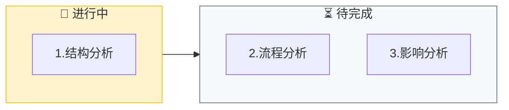
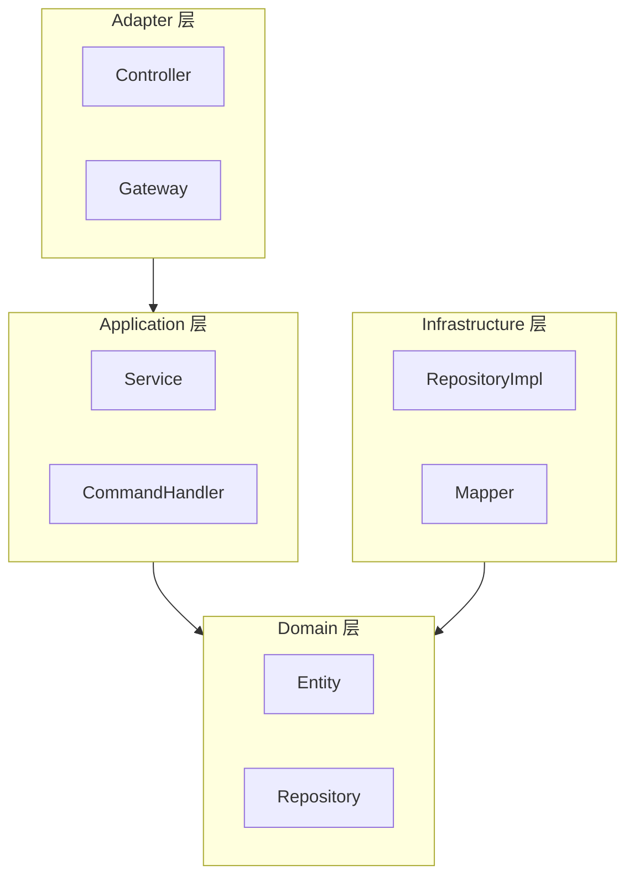
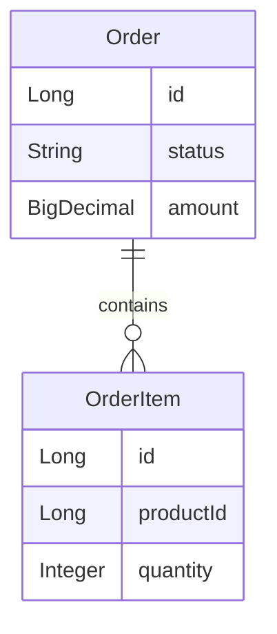
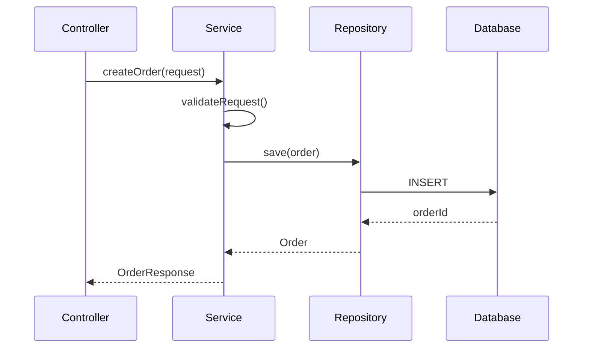
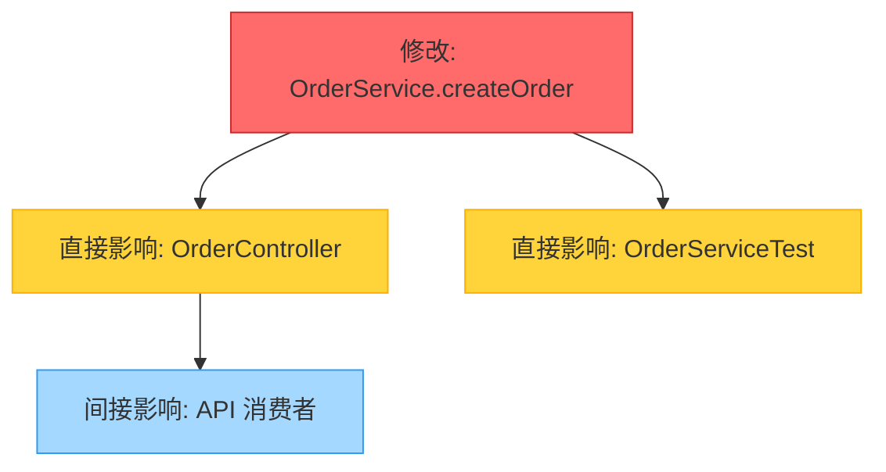

# Code Analysis (代码深度解析)

⚠️ **CRITICAL**: 执行此技能时，MUST 先执行初始化检查，禁止直接开始分析代码。

**⚠️ 第一步必须执行**: 无论用户消息中是否包含输入，都必须先输出"初始化检查"部分的模板，等待用户提供分析目标和确认分析模式后，才能开始执行后续步骤。

此技能帮助开发者快速理解陌生代码库，生成可视化的逻辑视图和影响面评估。

> **交互协议**: 本指令严格遵循 `jl-skills/instructions/INTERACTION_PROTOCOL.md` 中定义的交互规范。

---

## ⚠️ 关键行为约束 (CRITICAL BEHAVIOR CONSTRAINTS)

> **这些约束是强制性的，违反将导致流程失败。**

### 约束 0: 初始化检查规则 ⚠️ CRITICAL

```
🛑 STOP RULE: 必须先询问输入

执行任何步骤前，MUST 先检查用户是否提供了必要的输入：
- 有输入 → 确认输入后询问分析模式，然后开始执行
- 无输入 → 必须先询问，禁止直接开始执行

⚠️ 禁止行为：
- ❌ 禁止直接开始分析代码
- ❌ 禁止跳过初始化检查
- ❌ 禁止假设用户意图

✅ 必须行为：
- ✅ 必须先输出初始化检查模板
- ✅ 必须等待用户提供分析目标
- ✅ 必须等待用户确认分析模式
```

### 约束 1: 单步输出规则

```
🛑 ONE STEP AT A TIME

- 每次回复只输出一个步骤的内容
- 每个步骤输出后必须停止，等待用户确认
- 禁止在一次回复中包含多个步骤的内容
- 用户回复"确认/继续/OK"后才能输出下一步
```

### 约束 2: 对话框输出 vs 文件写入

```
📤 对话框输出 (每个步骤):
- 进度条和看板表格
- 技术栈和模块结构
- Mermaid 图表（ER图、时序图、流程图等）
- 确认问题

📁 文件写入 (阶段结束时):
- 步骤3完成后自动写入分析报告
```

---

## 能力 (Capabilities)

- **静态结构**: 技术栈、模块划分、ER图、入口点
- **动态流程**: 调用链、时序图
- **逻辑解读**: 复杂算法、状态机翻译
- **影响分析**: 变更波及范围评估

---

## 初始化检查 ⚠️ CRITICAL

> **⚠️ 强制要求**: 无论用户消息中是否包含输入，都必须先执行此初始化检查，禁止直接开始分析代码。

### 检查 1: 分析目标

**⚠️ 执行规则（强制）**:
1. **第一步**: 必须先输出下面的"输出模板"，禁止跳过
2. **第二步**: 等待用户提供分析目标
3. **第三步**: 用户提供输入后，确认输入并询问分析模式

**禁止行为**:
- ❌ 禁止直接开始分析代码
- ❌ 禁止直接开始生成结构图
- ❌ 禁止跳过初始化检查
- ❌ 禁止假设用户意图

**必须行为**:
- ✅ 必须先输出下面的模板
- ✅ 必须等待用户回复
- ✅ 必须等待用户确认分析模式

**输出模板（必须输出）**:

```markdown
## 开始代码分析

我已准备好进行代码分析。

**整体流程**:
- 步骤1: 结构分析 - 技术栈、模块结构、依赖关系
- 步骤2: 链路分析 - 核心业务流程时序图
- 步骤3: 影响分析 - 变更影响面、风险评估（可选）

---

🛑 **需要您的输入**

**第一步：请告诉我您想分析什么？**

请提供以下信息之一：
1. 选中要分析的代码
2. 提供代码文件路径（如 `src/OrderService.java`）
3. 指定要分析的方法或功能（如 "分析创建订单的逻辑"）

**请问您希望分析什么？**
```

**🛑 STOP - 等待用户提供输入**

⚠️ **重要**:
- 用户未提供输入前，禁止执行任何后续步骤
- 禁止直接开始分析代码
- 禁止假设用户意图
- 必须等待用户明确回复

---

### 检查 2: 用户角色确认

**前置条件**:
- ✅ 用户已提供分析目标输入
- ✅ 已输出检查1的模板并等待用户回复

**⚠️ 执行规则（强制）**:
1. **第一步**: 确认用户提供的分析目标
2. **第二步**: **必须输出下面的用户角色确认模板**，禁止跳过
3. **第三步**: 等待用户确认角色
4. **禁止行为**:
    - ❌ 禁止直接开始分析代码
    - ❌ 禁止跳过角色确认
    - ❌ 禁止假设用户角色

用户提供输入后，**必须询问用户角色**：

```markdown
---

🛑 **用户角色确认**

我已收到您的分析目标：[确认用户提供的分析目标]

**请选择您的角色，这将影响分析的重点和输出内容：**

1. **开发人员** - 重点关注：
   - 架构设计和实现细节
   - 技术栈和模块结构
   - 调用链和依赖关系
   - 代码实现方式和技术选型
   - **输出格式**: 详细的技术图表（ER图、时序图、调用链图）

2. **非开发人员（业务/产品/测试等）** - 重点关注：
   - 业务逻辑和功能说明
   - 业务流程和状态流转
   - 业务规则和校验逻辑
   - 用通俗语言解释功能含义
   - **输出格式**: 业务流程图、状态流转图（用业务语言）

**请选择您的角色 [1/2]：**
```

**🛑 STOP - 等待用户确认角色**

⚠️ **重要**:
- 用户未确认角色前，禁止执行任何后续步骤
- 必须等待用户明确回复
- **角色信息必须传递给后续所有步骤，用于调整输出内容和重点**

---

### 检查 3: 分析模式确认

**前置条件**:
- ✅ 用户已确认角色
- ✅ 已输出检查2的模板并等待用户回复

**⚠️ 执行规则（强制）**:
1. **第一步**: 确认用户选择的角色（必须明确记录：开发人员/非开发人员）
2. **第二步**: 根据角色输出分析重点说明
3. **第三步**: 输出分析模式确认模板
4. **第四步**: 等待用户确认开始分析
5. **第五步**: **将用户角色信息保存到状态中**，供后续所有步骤使用

用户确认角色后，根据角色说明分析重点：

**如果是开发人员**:
```markdown
---

🛑 **分析重点确认**

**您的角色**: 开发人员 ✅

**分析重点**:
- ✅ 架构设计和实现细节
- ✅ 技术栈和模块结构
- ✅ 调用链和依赖关系
- ✅ 代码实现方式和技术选型
- ✅ 异常处理和性能优化点

**分析模式**:
- **结构分析** - 详细分析技术栈、架构设计、模块划分、依赖关系（输出 ER 图、模块结构图）
- **流程分析** - 深入分析调用链、时序图、技术实现细节（输出调用链图、时序图）
- **影响分析** - 评估变更影响面、风险评估（输出影响关系图）

**输出格式**: 所有分析结果将使用 Mermaid 图表可视化（ER 图、时序图、流程图、状态机图等）

**是否确认开始分析？**
```

**如果是非开发人员**:
```markdown
---

🛑 **分析重点确认**

**您的角色**: 非开发人员 ✅

**分析重点**:
- ✅ 业务逻辑和功能说明
- ✅ 业务流程和状态流转
- ✅ 业务规则和校验逻辑
- ✅ 用通俗语言解释功能含义
- ✅ 用户操作和系统响应

**分析模式**:
- **结构分析** - 说明功能模块、业务边界、数据模型（用通俗语言，输出业务模块图）
- **流程分析** - 说明业务流程、业务规则、状态流转（用业务语言，输出业务流程图、状态流转图）
- **影响分析** - 不适用（仅开发人员需要）

**输出格式**: 所有分析结果将使用 Mermaid 图表可视化（业务流程图、状态流转图等），避免技术术语

**是否确认开始分析？**
```

**🛑 STOP - 等待用户确认**

⚠️ **重要**:
- 用户未确认开始分析前，禁止执行任何后续步骤
- 必须等待用户明确回复
- **用户角色信息必须传递给后续所有步骤，用于调整输出内容和重点**

---

## 执行流程

⚠️ **前置条件检查**:
在执行任何步骤之前，MUST 先完成以下检查：
- ✅ 已输出检查1的模板（分析目标询问）
- ✅ 用户已提供分析目标
- ✅ 已输出检查2的模板（用户角色确认）
- ✅ 用户已确认角色
- ✅ 已输出检查3的模板（分析模式确认）
- ✅ 用户已确认开始分析

**如果以上条件未满足，禁止执行后续步骤，必须先完成初始化检查。**

**⚠️ 重要**: 根据用户角色，分析重点和输出内容会有所不同：
- **开发人员**: 重点关注架构、实现细节、技术选型
- **非开发人员**: 重点关注业务逻辑、功能说明、通俗解释

---

### 步骤 1: 静态结构分析

**加载**: `jl-skills/instructions/analyze/structure-analysis-instructions.md`

**⚠️ 执行规则（强制）**:
1. **获取用户角色**（从初始化检查中获取，必须已确认）
2. **根据角色调整输出重点**:
    - **开发人员**: 重点关注技术栈、架构设计、模块划分、ER图、调用关系
    - **非开发人员**: 重点关注功能模块、业务边界、数据模型，用通俗语言解释
3. **只加载并执行步骤 1**（技术栈与项目概览）
4. **优先输出 Mermaid 图**（每个步骤至少一个图）:
    - 步骤 1.1: 输出模块结构图（flowchart 或 graph）
    - 步骤 1.2: 输出 ER 图（erDiagram）
    - 步骤 1.3: 输出接口关系图（graph 或 flowchart）
5. **代码截取作为补充**：可以在图表后添加关键代码片段作为详细说明，但必须以图表为主
6. **输出步骤 1 的内容后，立即停止**
7. **等待用户确认后**，才能继续执行步骤 2（如果有）
8. **禁止一次性输出多个步骤的内容**
9. **禁止跳过用户确认**
10. **禁止忽略角色信息，必须根据角色调整输出**

**输出**: 技术栈与项目概览（只输出步骤 1 的内容，必须包含 Mermaid 图）

**🛑 STOP HERE - 必须等待用户确认后才能继续**

⚠️ **重要**:
- 用户未回复"确认"前，禁止执行任何后续步骤
- 禁止输出步骤2的内容
- 禁止输出步骤 1 的子步骤（步骤 1.2、1.3）的内容（直到用户确认步骤 1.1）
- **优先输出 Mermaid 图，每个步骤至少一个图**
- **代码截取可以作为补充说明，但必须以图表为主**
- **必须根据用户角色调整输出内容和重点**

**输出格式**:

````markdown
## 步骤 1: 静态结构分析

**目标**: 识别代码整体结构

📊 **当前进度**: [1/3] 结构分析
[███████░░░░░░░░░░░░░] 33%



---

### 技术栈
- **框架**: Spring Boot 2.7
- **ORM**: MyBatis-Plus
- **数据库**: MySQL 8.0

### 模块结构



### 核心实体 (ER)



---

📋 **确认检查点**

结构分析完成。

- 回复 **确认** → 进入流程分析
- 回复 **深入 [模块名]** → 我将详细展开

**请确认：** 是否继续流程分析？
````

**[等待用户确认]**

---

### 步骤 2: 动态流程分析

**前置条件**: 用户已确认步骤1

**加载**: `jl-skills/instructions/analyze/flow-analysis-instructions.md`

**⚠️ 执行规则（强制）**:
1. **获取用户角色**（从初始化检查中获取，必须已确认）
2. **根据角色调整输出重点**:
    - **开发人员**: 重点关注调用链、技术实现、方法调用关系、时序图、技术细节
    - **非开发人员**: 重点关注业务流程、业务规则、状态流转，用通俗语言解释"用户做什么 → 系统做什么 → 结果是什么"，避免技术术语
3. **只加载并执行步骤 1**（调用链路分析）
4. **优先输出 Mermaid 图**（每个步骤至少一个图）:
    - 步骤 2.1: 输出调用链图（graph TD 或 flowchart）
    - 步骤 2.2: 输出时序图（sequenceDiagram）
    - 步骤 2.3: 输出状态机图（stateDiagram-v2，如果有复杂状态流转）
5. **代码截取作为补充**：可以在图表后添加关键代码片段作为详细说明，但必须以图表为主
6. **输出步骤 1 的内容后，立即停止**（必须根据角色输出对应格式）
7. **等待用户确认后**，才能继续执行步骤 2（如果有）
8. **禁止一次性输出多个步骤的内容**
9. **禁止跳过用户确认**
10. **禁止忽略角色信息，必须根据角色调整输出**

**输出**: 调用链路分析（只输出步骤 1 的内容，必须包含 Mermaid 图，根据角色调整重点和格式）

**🛑 STOP HERE - 必须等待用户确认后才能继续**

⚠️ **重要**:
- 用户未回复"确认"前，禁止执行任何后续步骤
- 禁止输出步骤3的内容
- 禁止输出步骤 2 的子步骤（步骤 2.2、2.3）的内容（直到用户确认步骤 2.1）
- **优先输出 Mermaid 图，每个步骤至少一个图**
- **代码截取可以作为补充说明，但必须以图表为主**
- **必须根据用户角色调整输出内容和重点**

**输出格式**:

````markdown
## 步骤 2: 动态流程分析

**目标**: 追踪核心业务链路

📊 **当前进度**: [2/3] 流程分析
[██████████████░░░░░░] 66%

---

### 核心链路时序图



### 调用链分析

| 入口 | 调用路径 | 出口 |
|------|----------|------|
| OrderController.create() | → OrderService → OrderRepository | DB |
| OrderController.pay() | → OrderService → PaymentGateway | 第三方支付 |

---

📋 **确认检查点**

流程分析完成。

- 回复 **确认** → 进入影响分析
- 回复 **追踪 [方法名]** → 我将展开该链路

**请确认：** 是否需要影响分析？
````

**[等待用户确认]**

---

### 步骤 3: 影响面分析 (可选，仅开发人员)

**前置条件**: 用户已确认步骤2

**触发条件**:
- 用户角色为"开发人员"
- 用户询问"如果修改 X 会影响什么"

**⚠️ 执行规则（强制）**:
1. **检查用户角色**: 如果用户角色为"非开发人员"，跳过此步骤
2. **获取用户角色**（从初始化检查中获取，必须已确认）
3. **只加载并执行步骤 1**（依赖引用分析）
4. **输出步骤 1 的内容后，立即停止**
5. **等待用户确认后**，才能继续执行步骤 2（如果有）
6. **禁止一次性输出多个步骤的内容**
7. **禁止跳过用户确认**

**加载**: `jl-skills/instructions/analyze/impact-analysis-instructions.md`

**输出**: 依赖引用分析（只输出步骤 1 的内容）

**🛑 STOP HERE - 必须等待用户确认后才能继续**

⚠️ **重要**:
- 用户未回复"确认"前，禁止执行任何后续步骤
- 禁止输出步骤 3 的子步骤（步骤 3.2、3.3）的内容（直到用户确认步骤 3.1）
- **非开发人员不执行此步骤**

**输出格式**:

````markdown
## 步骤 3: 影响面分析

**目标**: 评估变更波及范围

📊 **当前进度**: [3/3] 影响分析
[████████████████████] 100%

---

### 变更影响范围



### 风险评估

| 影响类型 | 文件/模块 | 风险等级 |
|----------|-----------|----------|
| 直接调用 | OrderController | 🟠 中 |
| 测试覆盖 | OrderServiceTest | 🟢 低 |
| API 契约 | 外部消费者 | 🔴 高 |

### 建议
1. 修改前确保单元测试通过
2. 检查 API 契约是否变化
3. 通知下游消费者

---

📋 **确认检查点**

影响分析完成。

- 回复 **确认** → 自动保存报告
- 回复 **详细 [模块]** → 我将展开

**请确认：** 影响分析是否准确？
````

**[等待用户确认]**

---

## 分析完成: 自动写入报告

**触发条件**: 用户确认步骤3后，**立即执行**：

### 1. 写入报告

```
写入文件: jl-skills/generated/analyze/{date}/Code_Analysis_Report.md
模板: jl-skills/templates/JL-Template-Analyze-Code.md
```

### 2. 输出完成总结

```markdown
---

## ✅ 代码分析完成

| ✅ 已完成 |
|:----------|
| 1. 结构分析 |
| 2. 链路分析 |
| 3. 影响分析 |

### 📄 已写入文件

**文件**: `jl-skills/generated/analyze/{date}/Code_Analysis_Report.md`

**包含内容**:
- ✓ 技术栈和模块结构
- ✓ 核心链路时序图
- ✓ 影响面分析

---

### 🗂️ 归档建议

**后续操作**: 运行 `/docs` 指令将本次分析结果归档为 ADR，并更新文档体系。

**归档内容**:
- ADR 记录: 分析目标、关键发现、架构洞察
- 文档更新: `docs/ARCHITECTURE.md`（架构信息）

**后续建议**:
- 使用 `/review` 进行代码审查
- 使用 `/test` 生成测试用例
```
