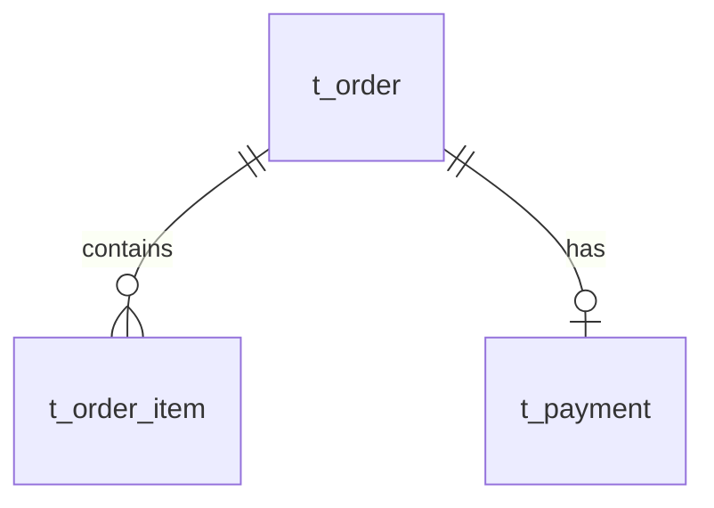

# DDD Design (产研统一设计)

## ⚠️ 关键行为约束 (CRITICAL BEHAVIOR CONSTRAINTS)

> **这些约束是强制性的，违反将导致流程失败。**

### 约束 1: 必须停顿等待确认

```
🛑 STOP RULE:
- 每完成一个步骤，MUST 停止并等待用户回复
- 在用户回复"确认"、"继续"、"OK"之前，DO NOT 输出下一步内容
- 禁止在一次回复中输出多个步骤的内容
```

### 约束 2: 对话框 vs 文件

```
📤 对话框输出 (Chat Output):
- 进度条和看板图
- 表格预览（数据字典、业务规则等）
- Mermaid 图表（流程图、时序图、类图等）
- 确认问题

📁 文件写入 (File Write):
- 只在阶段完成且用户确认后才写入
- 写入完整的 Markdown 文档
- 阶段1 完成 → 写入 Requirements_Design.md
- 阶段2 完成 → 写入 DDD_Design.md
```

### 约束 3: 单步输出格式

每个步骤的输出必须遵循以下格式：

```markdown
## 步骤 X: [步骤名称]

📊 **进度**: [X/N] [步骤名称]
[进度条]

[Mermaid 看板图]

---

[本步骤的产物内容]

---

🛑 **确认点**

[针对本步骤的具体问题]

请回复：
- **确认** → 进入下一步
- **修改** → 我将调整
```

---

## 📦 交付物与阶段划分

| 阶段 | 聚焦点 | 步骤数 | 交付文档 |
|------|--------|--------|----------|
| **阶段1** | 需求理解 | 7步 | `Requirements_Design.md` |
| **阶段2** | 领域建模 | 12步 | `DDD_Design.md` |
| **阶段3** | 知识补充 | 4步 | `Architecture_Knowledge_Guide.md` |
| **阶段4** | 代码落地 | N步 | 源代码 + 测试 |

---

## 阶段1: 产研通用设计 (需求理解)

**聚焦**: 理解业务需求，建立统一语言，梳理业务流程

| 步骤 | 内容 | 输出 |
|------|------|------|
| 1.1 | 边界定义 | 业务背景、In/Out Scope、依赖、利益攸关者 |
| 1.2 | 数据字典 | 术语定义表（统一语言） |
| 1.3 | 业务流程 | 流程图 + 时序图 |
| 1.4 | 功能清单 | 功能列表 + 接口定义 |
| 1.5 | 用户故事 | 用户故事 + 验收标准 |
| 1.6 | 业务规则 | 规则列表 + 约束条件 |
| 1.7 | 系统上下文 | C4 Context 图（系统与外部的关系） |

**阶段1不包含**: 部署架构、监控告警、数据库设计（这些在后续阶段）

---

## 阶段2: DDD 设计 (领域建模)

**聚焦**: 事件风暴 → 限界上下文 → 聚合设计 → 数据库推导

> ⚠️ **贫血模型**: 遵循 `jl-skills/specs/DDD与可视化规范.md` 中的贫血模型规范

| 步骤 | 内容 | 输出 |
|------|------|------|
| **事件风暴** | | |
| 2.1 | 领域事件 | 事件表 + 时间线图 |
| 2.2 | 命令识别 | 命令表 + 关系图 |
| 2.3 | 聚合识别 | 聚合表 + 关系图 |
| 2.4 | 策略与热点 | 策略表 + 热点表 |
| 2.5 | 事件风暴图 | 全景图 |
| **限界上下文** | | |
| 2.6 | 限界上下文 | 上下文表 + Context Map |
| 2.7 | 子域划分 | 核心/支撑/通用域 |
| **聚合设计** | | |
| 2.8 | 聚合根设计 | 代码片段 + 行为表 |
| 2.9 | 实体与值对象 | 代码片段 + 判断依据 |
| 2.10 | 聚合间关系 | 关系表 + 事件流图 |
| **可视化** | | |
| 2.11 | 类图与目录结构 | 类图 + COLA 目录 |
| 2.12 | **数据库设计** | DDL + ER 图（从领域模型推导） |

**注意**: 数据库设计在领域建模完成后进行，从聚合 → 表的映射

---

## 阶段3: 知识补充 (架构决策与领域知识)

**聚焦**: 设计辩护、行业洞察、架构演进

**角色**: 资深架构师导师 & 行业领域专家

| 步骤 | 内容 | 输出 |
|------|------|------|
| 3.1 | 角色切换与准备 | 加载 DDD 设计文档，切换为导师模式 |
| 3.2 | 设计辩护 (Design Defense) | 边界划分逻辑、聚合根选择、Trade-offs |
| 3.3 | 行业领域雷达 (Domain Insight) | 暗知识、避坑指南、通用语言澄清 |
| 3.4 | 拓展与进阶 (Advanced Extensions) | 未来演进、技术落地建议 |

**加载指令**: `jl-skills/instructions/design/knowledge-supplement-instructions.md`

---

## 阶段4: TDD+BDD 代码生成

**策略**: Walking Skeleton - 先完整实现一个核心接口，再逐个叠加

**加载指令**: `jl-skills/instructions/design/tdd-implementation-instructions.md`

**🛑 阶段4完成后，输出完成总结并提示归档**

**完成总结格式**:

````markdown
## ✅ DDD 设计流程完成

| ✅ 已完成 |
|:----------|
| 阶段1: 产研通用设计 |
| 阶段2: DDD设计 |
| 阶段3: 知识补充 |
| 阶段4: TDD代码生成 |

### 📄 已生成文档

| 文档 | 路径 |
|------|------|
| 产研设计文档 | `jl-skills/generated/design/{date}/Requirements_Design.md` |
| DDD设计文档 | `jl-skills/generated/design/{date}/DDD_Design.md` |
| 架构知识指南 | `jl-skills/generated/design/{date}/Architecture_Knowledge_Guide.md` |
| TDD代码 | `{源代码目录}` |

### 🗂️ 归档建议

**后续操作**: 运行 `/docs` 指令将本次设计结果归档为 ADR，并更新文档体系。

**归档内容**:
- ADR 记录: 设计决策、架构选择、TDD 成果
- 文档更新: `docs/FEATURES/{module}/`（设计文档）和 `docs/ARCHITECTURE.md`（架构信息）

---

**设计流程已完成！建议运行 `/docs` 归档文档。**
````

---

## 执行流程

### 初始化

**必须先询问需求**:

```markdown
## 开始产研设计

我将帮您执行完整的 DDD 设计流程。

**整体流程**:
- 阶段1: 产研通用设计 (7步) - 理解需求
- 阶段2: DDD设计 (12步) - 领域建模 + 数据库设计
- 阶段3: 知识补充 (4步) - 架构决策与领域知识
- 阶段4: TDD代码生成 - 代码落地

---

🛑 **需要您的输入**

请提供以下信息之一：
1. PRD 或需求文档路径
2. 直接描述您的业务需求
3. 选中相关的代码文件

**请提供您的需求：**
```

**🛑 STOP - 等待用户提供需求**

---

### 阶段1步骤详情

**加载指令**: `jl-skills/instructions/design/requirements-design-instructions.md`

每个步骤格式：

```markdown
## 步骤 1.X: [名称]

📊 **进度**: [X/7] [名称]
[进度条]

[Mermaid 看板图]

---

[本步骤内容: 表格/图表]

---

🛑 **确认点**

[具体问题]

请回复：
- **确认** → 进入下一步
- **修改** → 我将调整
```

**🛑 每步必须停顿等待确认**

---

### 阶段2步骤详情

**加载指令**: 
- `jl-skills/instructions/design/event-storming-instructions.md`
- `jl-skills/instructions/design/ddd-modeling-instructions.md`

**重点**: 步骤 2.12 数据库设计

**🛑 阶段2完成后自动写入 `DDD_Design.md`，然后进入阶段3**

---

### 阶段3步骤详情

**加载指令**: `jl-skills/instructions/design/knowledge-supplement-instructions.md`

**角色切换**: 从"建模构建者"切换为"资深架构师导师 & 行业领域专家"

**输出格式**: 同阶段1/2，每步包含进度条、看板、确认点

**🛑 阶段3完成后自动写入 `Architecture_Knowledge_Guide.md`，然后进入阶段4**

```markdown
## 步骤 2.12: 数据库设计

📊 **进度**: [12/12] 数据库设计

---

### 从领域模型推导数据库表

基于已确认的聚合设计，推导数据库表结构：

| 聚合 | 表名 | 说明 |
|------|------|------|
| Order | t_order | 订单主表 |
| OrderItem | t_order_item | 订单项表 |
| Payment | t_payment | 支付表 |

### DDL 脚本

```sql
-- 从 Order 聚合推导
CREATE TABLE t_order (
    id BIGINT PRIMARY KEY,
    order_no VARCHAR(32) NOT NULL,
    -- 从 OrderStatus 值对象推导
    status VARCHAR(20) NOT NULL,
    -- 从 Money 值对象推导
    total_amount DECIMAL(10,2) NOT NULL,
    ...
);
```

### ER 图



---

🛑 **确认点**

数据库设计是否合理？表结构是否正确反映了领域模型？

请回复：
- **确认** → 完成阶段2，写入文档
- **调整** → 我将修改
```

---

## 示例：正确的交互流程

```
User: 我要做一个订单系统
Agent: [输出步骤1.1 边界定义] 🛑 请确认边界是否正确？
User: 确认
Agent: [输出步骤1.2 数据字典] 🛑 请确认术语是否正确？
User: 确认
...
```

**❌ 错误示例**:
```
User: 我要做一个订单系统
Agent: [一次性输出所有步骤的内容]
```

---

## 参考文档

- 交互协议: `jl-skills/instructions/INTERACTION_PROTOCOL.md`
- 产研设计模板: `jl-skills/templates/JL-Template-Requirements-Design.md`
- DDD设计模板: `jl-skills/templates/JL-Template-DDD-Design.md`

---

## ⚠️ 可视化规范 (MANDATORY)

**生成事件风暴图时，必须读取并遵循**:

📄 **`jl-skills/specs/DDD与可视化规范.md`**

从该文件获取：
- classDef 样式定义（颜色、边框等）
- Emoji 标签规范（👤📝⚡🎯⚠️🏗️🔗📊）
- Mermaid 模板结构

**禁止**: 自行定义样式或省略 emoji。
