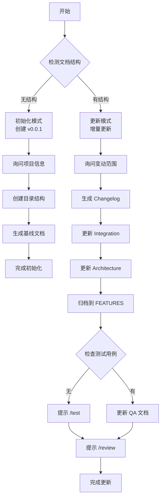

# Project Docs (文档管家)

⚠️ **CRITICAL**: 执行此技能时，MUST 先执行初始化检查，禁止直接开始检测或更新文档。

**⚠️ 第一步必须执行**: 无论用户消息中是否包含输入，都必须先输出"初始化检查"部分的模板，等待用户提供变动范围和需求信息后，才能开始执行后续步骤。

此技能智能管理项目全生命周期文档，支持**从零初始化**或**增量更新**。

> **交互协议**: 本指令严格遵循 `jl-skills/instructions/INTERACTION_PROTOCOL.md` 中定义的交互规范。

---

## ⚠️ 关键行为约束 (CRITICAL BEHAVIOR CONSTRAINTS)

> **这些约束是强制性的，违反将导致流程失败。**

### 约束 0: 初始化检查规则 ⚠️ CRITICAL

```
🛑 STOP RULE: 必须先询问输入

执行任何步骤前，MUST 先检查用户是否提供了必要的输入：
- 有输入 → 确认输入后开始执行
- 无输入 → 必须先询问，禁止直接开始执行

⚠️ 禁止行为：
- ❌ 禁止直接开始检测文档结构
- ❌ 禁止直接开始更新文档
- ❌ 禁止跳过初始化检查
- ❌ 禁止假设用户意图

✅ 必须行为：
- ✅ 必须先输出初始化检查模板
- ✅ 必须等待用户提供变动范围和需求信息
- ✅ 必须等待用户确认
```

### 约束 1: 单步输出规则

```
🛑 ONE STEP AT A TIME

- 每步只做一件事，确认后再下一步
- 每个步骤输出后必须停止，等待用户确认
- 禁止在一次回复中包含多个步骤的内容
- 用户回复"确认/继续/OK"后才能输出下一步
```

### 约束 2: 对话框输出 vs 文件写入

```
📤 对话框输出 (每个步骤):
- 进度条和看板表格
- 变更预览
- 确认问题

📁 文件写入 (阶段结束时):
- 每个阶段完成后自动写入对应的文档文件
```

---

## 初始化检查 ⚠️ CRITICAL

> **⚠️ 强制要求**: 无论用户消息中是否包含输入，都必须先执行此初始化检查，禁止直接开始检测或更新文档。

### 检查 1: 变动范围和需求

**⚠️ 执行规则（强制）**:
1. **第一步**: 必须先输出下面的"输出模板"，禁止跳过
2. **第二步**: 等待用户提供变动范围和需求信息
3. **第三步**: 用户提供输入后，确认输入并开始执行

**禁止行为**:
- ❌ 禁止直接开始检测文档结构
- ❌ 禁止直接开始更新文档
- ❌ 禁止跳过初始化检查
- ❌ 禁止假设用户意图

**必须行为**:
- ✅ 必须先输出下面的模板
- ✅ 必须等待用户回复
- ✅ 必须等待用户提供变动范围和需求信息

**输出模板（必须输出）**:

```markdown
## 开始文档管理

我已准备好管理项目文档。

**整体流程**:
- 步骤1: 智能检测 - 检测文档结构，决定初始化或更新模式
- 步骤2: 收集信息 - 询问项目信息（初始化模式）或变动范围（更新模式）
- 步骤3: 执行操作 - 创建/更新文档
- 步骤4: 归档和提示 - 归档文档，提示后续操作

---

🛑 **需要您的输入**

**如果是初始化模式**（检测到缺少文档结构）:
- 请提供项目信息：项目名称、描述、技术栈、负责人等

**如果是更新模式**（已有文档结构）:
- 请提供变动范围：本次变动的范围（如：新增订单功能、修复支付bug等）

**请提供信息：**
```

**🛑 STOP - 等待用户提供输入**

⚠️ **重要**:
- 用户未提供输入前，禁止执行任何后续步骤
- 禁止直接开始检测文档结构
- 必须等待用户明确回复

---

## 核心流程



---

## 执行流程

⚠️ **前置条件检查**:
在执行任何步骤之前，MUST 先完成以下检查：
- ✅ 已输出初始化检查模板
- ✅ 用户已提供信息（初始化模式：项目信息 / 更新模式：变动范围）

**如果以上条件未满足，禁止执行后续步骤，必须先完成初始化检查。**

⚠️ **重要**:
- 如果检测到文档结构不完整，**必须先完成初始化**，初始化完成后再检查是否有未归档文档进行集成
- 初始化完成后，如果检测到未归档文档，会询问用户是否立即集成

---

## 阶段 1: 智能检测

**前置条件**: 用户已提供变动范围和需求信息

**⚠️ 执行规则（强制）**:
1. **只输出阶段 1 的内容**（智能检测结果），然后停止
2. **等待用户确认后**，才能继续执行后续阶段
3. **禁止一次性输出多个阶段的内容**
4. **禁止跳过用户确认**

**检测项**:
1. 是否存在 `README.md`
2. 是否存在 `docs/` 目录
3. 是否存在 `docs/CHANGELOG/` 目录（注意：不是 `CHANGELOG.md`）
4. 是否存在 `docs/FEATURES/` 目录
5. 是否存在 `docs/INTEGRATION.md`
6. 是否存在 `docs/ARCHITECTURE.md`

**决策逻辑**:
1. **首先检查文档结构**:
    - **缺失任意一项（1-6）** → **必须先进入初始化模式**
    - **全部存在** → 继续检查未归档文档
2. **如果文档结构完整，再检查未归档文档**:
    - **存在 `jl-skills/generated/` 中未归档的文档** → 更新模式（集成变更）
    - **无未归档文档** → 更新模式（仅更新文档）

**⚠️ 重要**:
- 如果文档结构不完整，**必须先完成初始化**，初始化完成后再检查是否有未归档文档进行集成
- 初始化完成后，如果检测到未归档文档，会询问用户是否立即集成
- 目录结构必须符合规范：`docs/CHANGELOG/`（目录）而不是 `CHANGELOG.md`（文件）

**输出**: 智能检测结果（只输出阶段 1 的内容）

**🛑 STOP HERE - 必须等待用户确认后才能继续**

⚠️ **重要**:
- 用户未回复"确认"前，禁止执行任何后续步骤
- 禁止输出后续阶段的内容

**输出格式**:

````markdown
## 阶段 1: 智能检测

📊 **进度**: [1/N] 智能检测
[████░░░░░░░░░░░░░░░░] XX%

| ✅ 已完成 | 🔄 进行中 | ⏳ 待完成 |
|:----------|:----------|:----------|
| | 1.智能检测 | 2.收集信息 |
| | | 3.执行操作 |
| | | 4.归档和提示 |

---

### 文档结构检测结果

| 检测项 | 状态 | 说明 |
|--------|------|------|
| README.md | ✅ 存在 / ❌ 不存在 | |
| docs/ 目录 | ✅ 存在 / ❌ 不存在 | |
| docs/CHANGELOG/ | ✅ 存在 / ❌ 不存在 | 必须是目录，不是文件 |
| docs/FEATURES/ | ✅ 存在 / ❌ 不存在 | |
| docs/INTEGRATION.md | ✅ 存在 / ❌ 不存在 | |
| docs/ARCHITECTURE.md | ✅ 存在 / ❌ 不存在 | |

**检测结论**: 
- **初始化模式** - 检测到缺少规范的文档结构，将初始化为 v0.0.{0|1}，**初始化完成后再检查未归档文档**
- **更新模式** - 检测到已有文档结构，将进行增量更新或集成变更

---

📋 **确认检查点**

检测结果是否准确？

- 回复 **确认** → 进入下一步（初始化模式：询问项目信息 / 更新模式：询问变动范围 / 收拢模式：扫描未归档文档）
- 回复 **调整: [说明]** → 我将调整

**请确认：** 检测结果是否准确？
````

**🛑 STOP HERE - 必须等待用户确认后才能继续**

⚠️ **重要**: 用户未回复"确认"前，禁止执行任何后续步骤。

---

## 分支 A: 初始化模式

**⚠️ 执行规则（强制）**:
1. **加载初始化指令**: `jl-skills/instructions/docs/init-structure-instructions.md`
2. **按顺序执行所有步骤**:
    - Step 1: 执行 `init-structure-instructions.md` 的步骤 1（确认元数据和系统状态）
    - Step 2: 执行 `init-structure-instructions.md` 的步骤 2（创建目录与文件）
    - Step 3: 执行 `init-structure-instructions.md` 的步骤 3（生成基线文档，包含 README.md）
    - Step 4: 如果是已有系统，执行 `init-structure-instructions.md` 的步骤 4（系统分析）
    - Step 5: 执行 `init-structure-instructions.md` 的步骤 5（完成初始化并检查未归档文档）
    - Step 6: 如果检测到未归档文档且用户选择集成，执行 `init-structure-instructions.md` 的步骤 6（集成未归档文档）
3. **每个步骤必须等待用户确认后才能继续**
4. **禁止一次性输出多个步骤的内容**

**目录结构规范**:

```
Project Root
├── README.md               # [门户] 项目总览和导航
├── docs/
│   ├── CHANGELOG/          # [演进] 宏观的项目迭代记录、版本发布日志
│   ├── INTEGRATION.md      # [接入] 对外的接入指南
│   ├── ARCHITECTURE.md     # [设计] 全局架构决策
│   └── FEATURES/           # [核心业务域] 需求和自测记录
│       └── {Order_Module}  # 具体功能/模块名
│           ├── SPEC.md     # 需求规格说明书
│           ├── CaseTest{spec}{time}.py # python 测试脚本
│           └── QA.md       # 验收用例 & 冒烟测试
```

**⚠️ 执行规则（强制）**:
1. **加载初始化指令**: `jl-skills/instructions/docs/init-structure-instructions.md`
2. **执行步骤 5**: 完成初始化并检查未归档文档
3. **如果检测到未归档文档**: 询问用户是否集成
4. **如果用户选择"是"**: 加载更新指令 `jl-skills/instructions/docs/update-docs-instructions.md` 执行集成流程

**输出格式**: 按照 `init-structure-instructions.md` 的步骤 5 输出格式执行

---

## 分支 B: 更新模式

### Step 1: 询问变动范围

**前置条件**: 用户已确认检测结果，进入更新模式

**输出**:

````markdown
## Step 1: 询问变动范围

📊 **进度**: [1/6] 变动信息收集
[████░░░░░░░░░░░░░░░░] 17%

| ✅ 已完成 | 🔄 进行中 | ⏳ 待完成 |
|:----------|:----------|:----------|
| 1.智能检测 | 1.变动信息 | 2.Changelog |
| | | 3.Integration |
| | | 4.Architecture |
| | | 5.归档FEATURES |
| | | 6.检查测试 |

---

检测到现有文档结构，进入**更新模式**。

### 扫描到的最近工件

| 类型 | 文件 | 生成时间 | 状态 |
|------|------|----------|------|
| 产研设计 | `jl-skills/generated/design/.../Requirements_Design_*.md` | 2小时前 | 📄 待归档 |
| DDD设计 | `jl-skills/generated/design/.../DDD_Design_*.md` | 1小时前 | 📄 待归档 |
| 测试用例 | - | - | ❌ 未发现 |
| 代码审查 | - | - | ❌ 未发现 |

---

请提供本次更新信息：

| 项目 | 说明 | 示例 |
|------|------|------|
| **版本号** | 语义化版本 | `1.0.0` / `1.1.0` / `1.0.1` |
| **功能模块名** | 用于归档目录 | `Payment` / `Order` |
| **变更类型** | 新增/优化/修复 | `新增微信支付功能` |
| **变更描述** | 简要说明 | `支持微信扫码支付...` |

**请提供变动信息：**
````

**🛑 STOP HERE - 必须等待用户提供变动信息后才能继续**

⚠️ **重要**: 用户未提供变动信息前，禁止执行任何后续步骤。

**[等待用户输入]**

---

### Step 2: 生成 Changelog

**输出**:

````markdown
## Step 2: 生成 Changelog

📊 **进度**: [2/6] Changelog

---

### Changelog 预览

```markdown
## [1.0.0] - 2024-01-20

### 🚀 新增功能 (Added)
- 微信支付功能
  - 支持微信扫码支付
  - 支持支付结果异步通知
  - 支持退款

### 🔧 优化改进 (Changed)
- (无)

### 🐛 Bug 修复 (Fixed)
- (无)

### ⚠️ 废弃 (Deprecated)
- (无)

### 🗑️ 移除 (Removed)
- (无)
```

---

📋 **确认检查点**

- 回复 **确认** → 写入 CHANGELOG.md 并继续
- 回复 **补充** → 我将添加变更项
- 回复 **修改** → 我将调整

**请确认：** Changelog 是否正确？
````

**[等待用户确认]**

---

### Step 3: 更新 Integration

**输出**:

````markdown
## Step 3: 更新 Integration

📊 **进度**: [3/6] Integration

---

### INTEGRATION.md 变更预览

```diff
# 集成说明

> 最后更新: 2024-01-20 | 版本: v1.0.0

## 外部依赖

+ ### 微信支付
+ - **服务**: 微信支付 API
+ - **用途**: 处理支付交易
+ - **配置项**:
+   - `wechat.pay.app-id`: 微信 AppID
+   - `wechat.pay.mch-id`: 商户号
+   - `wechat.pay.api-key`: API 密钥
+ - **文档**: https://pay.weixin.qq.com/docs
```

---

📋 **确认检查点**

- 回复 **确认** → 更新并继续
- 回复 **调整** → 我将修改

**请确认：** Integration 变更是否正确？
````

**[等待用户确认]**

---

### Step 4: 更新 Architecture

**输出**:

````markdown
## Step 4: 更新 Architecture

📊 **进度**: [4/6] Architecture

---

### ARCHITECTURE.md 变更预览

```diff
# 系统架构

> 最后更新: 2024-01-20 | 版本: v1.0.0

## 模块结构

+ ### 支付模块 (Payment)
+ 
+ 负责处理所有支付相关业务。
+ 
+ ```
+ payment/
+ ├── adapter/
+ │   └── PaymentController.java
+ ├── app/
+ │   └── PaymentService.java
+ └── domain/
+     └── Payment.java
+ ```

## 技术栈

+ - **支付**: 微信支付 SDK
```

---

📋 **确认检查点**

- 回复 **确认** → 更新并继续
- 回复 **调整** → 我将修改

**请确认：** Architecture 变更是否正确？
````

**[等待用户确认]**

---

### Step 5: 归档到 FEATURES

**输出**:

````markdown
## Step 5: 归档到 FEATURES

📊 **进度**: [5/6] 归档文档

---

### 归档操作

将执行以下操作：

```
docs/FEATURES/Payment/
├── SPEC.md          ← 复制自 jl-skills/generated/design/.../Requirements_Design_*.md
├── DDD.md           ← 复制自 jl-skills/generated/design/.../DDD_Design_*.md
└── README.md        ← 新建功能索引
```

### 功能索引 (README.md) 预览

```markdown
# Payment (支付模块)

> 版本: v1.0.0 | 创建时间: 2024-01-20

## 文档索引

| 文档 | 描述 |
|------|------|
| [SPEC.md](./SPEC.md) | 产研设计文档 |
| [DDD.md](./DDD.md) | DDD 设计文档 |

## 功能概述

微信支付功能，支持扫码支付、异步通知、退款。
```

---

📋 **确认检查点**

- 回复 **确认** → 执行归档并继续
- 回复 **调整模块名** → 我将修改目录名

**请确认：** 归档操作是否正确？
````

**[等待用户确认]**

---

### Step 6: 检查测试与收尾

**输出**:

````markdown
## Step 6: 检查测试与收尾

📊 **进度**: [6/6] 检查与收尾

---

### 测试用例检查

| 检查项 | 状态 | 建议 |
|--------|------|------|
| 场景测试用例 | ❌ 未发现 | 建议运行 `/test` 生成 |
| 单元测试 | ⚠️ 未扫描 | 请手动确认 |

### 代码审查检查

| 检查项 | 状态 | 建议 |
|--------|------|------|
| 代码审查报告 | ❌ 未发现 | 建议运行 `/review` |
| 技术栈更新 | ⚠️ 可能过时 | `/review` 会更新技术栈 |

---

### 🔔 后续建议

1. **生成测试用例**:
   ```
   /test
   ```
   生成后再次运行 `/docs` 将自动更新 QA 文档。

2. **代码审查**:
   ```
   /review
   ```
   会更新 ARCHITECTURE.md 中的技术栈和代码质量情况。

---

📋 **确认检查点**

- 回复 **确认** → 完成本次文档更新
- 回复 **现在运行 /test** → 我将切换到测试用例生成

**请确认：** 是否完成本次文档更新？
````

**[等待用户确认]**

---

### 文档更新完成: 每步自动写入

> ⚠️ **注意**: docs 流程每个步骤确认后**立即写入对应文件**

| 步骤确认 | 自动写入 |
|----------|----------|
| Step 2 | `CHANGELOG.md` |
| Step 3 | `docs/INTEGRATION.md` |
| Step 4 | `docs/ARCHITECTURE.md` |
| Step 5 | `docs/FEATURES/xxx/` 目录 |
| Step 6 (有测试) | `docs/FEATURES/xxx/QA.md` |

### 最终输出

````markdown
---

## ✅ 文档更新完成！

| ✅ 已完成 |
|:----------|
| 1. 变动信息收集 |
| 2. Changelog 更新 |
| 3. Integration 更新 |
| 4. Architecture 更新 |
| 5. FEATURES 归档 |
| 6. 测试用例检查 |

### 📄 已写入文件

| 文件 | 操作 |
|------|------|
| `CHANGELOG.md` | ✅ 新增 v1.0.0 |
| `docs/INTEGRATION.md` | ✅ 已更新 |
| `docs/ARCHITECTURE.md` | ✅ 已更新 |
| `docs/FEATURES/Payment/` | ✅ 已归档 |

### 🔜 下一步

| 指令 | 用途 |
|------|------|
| `/test` | 生成场景测试用例 |
| `/review` | 代码审查 |

---

**文档已更新到 vX.X.X，请执行 `git add .` 提交变更。**
````

---

## 分支 C: 收拢模式（归档 ADR 并汇总）

### Step 1: 扫描未归档文档

**前置条件**: 用户已确认检测结果，进入收拢模式

**⚠️ 执行规则（强制）**:
1. **只输出 Step 1 的内容**（扫描结果），然后停止
2. **等待用户确认后**，才能继续执行 Step 2
3. **禁止一次性输出多个步骤的内容**

**扫描内容**:
1. 扫描 `jl-skills/generated/` 目录下最近生成的文档
2. 检查是否已有对应的 ADR（通过文件名和日期匹配）
3. 识别需要归档的文档类型（design, review, test, analyze, migration, quick-fix, knowledge）

**输出格式**:

````markdown
## Step 1: 扫描未归档文档

📊 **进度**: [1/4] 文档收拢
[█████░░░░░░░░░░░░░░░] 25%

| ✅ 已完成 | 🔄 进行中 | ⏳ 待完成 |
|:----------|:----------|:----------|
| 1.智能检测 | 1.扫描文档 | 2.生成ADR |
| | | 3.归档汇总 |
| | | 4.完成 |

---

### 📋 扫描结果

**未归档文档**:

| 指令类型 | 文档路径 | 生成时间 | 状态 |
|----------|---------|----------|------|
| {/design} | `jl-skills/generated/design/{date}/Requirements_Design.md` | {时间} | 📄 待归档 |
| {/review} | `jl-skills/generated/review/{date}/Review_Report.md` | {时间} | 📄 待归档 |
| {/test} | `jl-skills/generated/test/{date}/Scenario_Test_Case.md` | {时间} | 📄 待归档 |

**总计**: {X} 个文档待归档

---

📋 **确认检查点**

扫描结果是否准确？

- 回复 **确认** → 开始生成 ADR 并归档
- 回复 **跳过: [文档路径]** → 我将跳过指定文档

**请确认：** 是否开始归档？
````

**🛑 STOP HERE - 必须等待用户确认后才能继续**

---

### Step 2: 生成 ADR 并归档

**前置条件**: 用户已确认扫描结果

**⚠️ 执行规则（强制）**:
1. **加载归档指令**: `jl-skills/instructions/docs/archive-instructions.md`
2. **逐个处理**: 对每个未归档文档，执行归档流程
3. **每完成一个 ADR 后停止**，等待用户确认后再处理下一个

**输出格式**:

````markdown
## Step 2: 生成 ADR 并归档

📊 **进度**: [2/4] 文档收拢
[███████████░░░░░░░░░] 50%

| ✅ 已完成 | ✅ 已完成 | 🔄 进行中 | ⏳ 待完成 |
|:----------|:----------|:----------|:----------|
| 1.智能检测 | 1.扫描文档 | 2.生成ADR | 3.归档汇总 |
| | | | 4.完成 |

---

### 📄 正在处理: {指令类型}

**文档**: `jl-skills/generated/{skill}/{date}/{文件}.md`

**ADR 编号**: `ADR-{YYYYMMDD}-{序号}`

**归档路径**: `docs/adr/ADR-{编号}.md`

---

📋 **确认检查点**

ADR 是否生成正确？

- 回复 **确认** → 写入 ADR 并继续下一个
- 回复 **调整: [内容]** → 我将修改

**请确认：** ADR 是否正确？
````

**🛑 STOP HERE - 必须等待用户确认后才能继续**

---

### Step 3: 汇总到文档体系

**前置条件**: 所有 ADR 已生成并归档

**⚠️ 执行规则（强制）**:
1. **更新文档索引**: 更新 `docs/adr/README.md`
2. **汇总到文档体系**:
    - 设计相关 → 更新 `docs/ARCHITECTURE.md` 和 `docs/FEATURES/`
    - 测试相关 → 更新 `docs/QA.md`
    - 集成相关 → 更新 `docs/INTEGRATION.md`
    - 审查相关 → 更新 `docs/ARCHITECTURE.md`（技术栈和质量）

**输出格式**:

````markdown
## Step 3: 汇总到文档体系

📊 **进度**: [3/4] 文档收拢
[█████████████████░░░] 75%

| ✅ 已完成 | ✅ 已完成 | ✅ 已完成 | 🔄 进行中 | ⏳ 待完成 |
|:----------|:----------|:----------|:----------|:----------|
| 1.智能检测 | 1.扫描文档 | 2.生成ADR | 3.归档汇总 | 4.完成 |

---

### 📋 汇总操作

**已更新文档**:

| 文档 | 操作 | 状态 |
|------|------|------|
| `docs/adr/README.md` | 更新索引 | ✅ |
| `docs/ARCHITECTURE.md` | 汇总架构决策 | ✅ |
| `docs/FEATURES/{module}/` | 归档功能文档 | ✅ |
| `docs/QA.md` | 更新测试索引 | ✅ |
| `docs/INTEGRATION.md` | 更新集成信息 | ✅ |

---

📋 **确认检查点**

汇总是否完整？

- 回复 **确认** → 完成收拢
- 回复 **调整: [文档]** → 我将调整

**请确认：** 汇总是否完整？
````

**🛑 STOP HERE - 必须等待用户确认后才能继续**

---

### Step 4: 完成

**输出格式**:

````markdown
## Step 4: 完成

📊 **进度**: [4/4] 文档收拢
[████████████████████] 100%

| ✅ 已完成 | ✅ 已完成 | ✅ 已完成 | ✅ 已完成 |
|:----------|:----------|:----------|:----------|
| 1.智能检测 | 1.扫描文档 | 2.生成ADR | 3.归档汇总 |
| | | | 4.完成 |

---

## ✅ 文档收拢完成

### 📄 归档总结

- ✅ 已生成 {X} 个 ADR 文档
- ✅ 已更新文档索引
- ✅ 已汇总到文档体系

### 📁 归档文件

| 文件 | 状态 |
|------|------|
| `docs/adr/ADR-{编号1}.md` | ✅ 已归档 |
| `docs/adr/ADR-{编号2}.md` | ✅ 已归档 |
| `docs/adr/README.md` | ✅ 已更新 |

---

**文档收拢完成！所有生成文档已归档并汇总。**
````

**🛑 STOP HERE - 收拢完成**

---

## 特殊场景: 有测试用例时

如果 Step 6 检测到测试用例存在，则执行 QA 文档更新：

````markdown
### 测试用例检查

| 检查项 | 状态 |
|--------|------|
| 场景测试用例 | ✅ 已发现 `jl-skills/generated/test/.../Scenario_Test_Case_*.md` |

### 更新 QA 文档

将执行以下操作：
1. 复制测试用例到 `docs/FEATURES/Payment/QA.md`
2. 更新 `docs/QA.md` 索引

```diff
# 测试文档索引

+ ## Payment 模块
+ - [场景测试用例](./FEATURES/Payment/QA.md)
+ - 覆盖场景: 12 个
+ - 最后更新: 2024-01-20
```

---

📋 **确认检查点**

- 回复 **确认** → 更新 QA 文档

**请确认：** 是否更新 QA 文档？
````

**[等待用户确认]**
