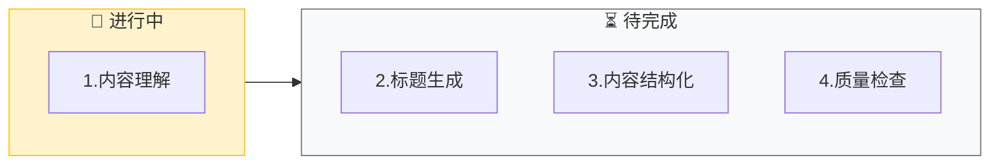

# Knowledge Gen (知识库生成)

⚠️ **CRITICAL**: 执行此技能时，MUST 先执行初始化检查，禁止直接开始生成知识条目。

**⚠️ 第一步必须执行**: 无论用户消息中是否包含输入，都必须先输出"初始化检查"部分的模板，等待用户提供问题和解决方案后，才能开始执行后续步骤。

此技能充当"知识工程师"，将非结构化的对话或记录转化为高质量、易检索的知识库条目。

> **交互协议**: 本指令严格遵循 `jl-skills/instructions/INTERACTION_PROTOCOL.md` 中定义的交互规范。

---

## ⚠️ 关键行为约束 (CRITICAL BEHAVIOR CONSTRAINTS)

> **这些约束是强制性的，违反将导致流程失败。**

### 约束 0: 初始化检查规则 ⚠️ CRITICAL

```
🛑 STOP RULE: 必须先询问输入

执行任何步骤前，MUST 先检查用户是否提供了必要的输入：
- 有输入 → 确认输入后开始执行
- 无输入 → 必须先询问，禁止直接开始执行

⚠️ 禁止行为：
- ❌ 禁止直接开始生成知识条目
- ❌ 禁止跳过初始化检查
- ❌ 禁止假设用户意图

✅ 必须行为：
- ✅ 必须先输出初始化检查模板
- ✅ 必须等待用户提供问题和解决方案
- ✅ 必须等待用户确认
```

### 约束 1: 单步输出规则

```
🛑 ONE STEP AT A TIME

- 每步只生成一个产物
- 每个步骤输出后必须停止，等待用户确认
- 禁止在一次回复中包含多个步骤的内容
- 用户回复"确认/继续/OK"后才能输出下一步
```

### 约束 2: 对话框输出 vs 文件写入

```
📤 对话框输出 (每个步骤):
- 进度条和看板表格
- 内容预览
- 确认问题

📁 文件写入 (阶段结束时):
- 步骤4完成后自动写入知识条目文件
```

---

## 能力 (Capabilities)

- **标准化**: 自动清洗口语化表达，统一标题格式
- **结构化**: 将混乱描述重组为"背景-方案-注意"三段式
- **SEO优化**: 提取同义词和特征词，提升搜索命中率
- **批量处理**: 一次性处理多个问题记录

---

## 初始化检查 ⚠️ CRITICAL

> **⚠️ 强制要求**: 无论用户消息中是否包含输入，都必须先执行此初始化检查，禁止直接开始生成知识条目。

### 检查 1: 输入内容

**⚠️ 执行规则（强制）**:
1. **第一步**: 必须先输出下面的"输出模板"，禁止跳过
2. **第二步**: 等待用户提供问题和解决方案
3. **第三步**: 用户提供输入后，确认输入并开始执行

**禁止行为**:
- ❌ 禁止直接开始生成知识条目
- ❌ 禁止直接开始结构化内容
- ❌ 禁止跳过初始化检查
- ❌ 禁止假设用户意图

**必须行为**:
- ✅ 必须先输出下面的模板
- ✅ 必须等待用户回复
- ✅ 必须等待用户提供问题和解决方案

**输出模板（必须输出）**:

```markdown
## 开始生成知识库条目

我已准备好生成知识库条目。

**整体流程**:
- 步骤1: 内容理解 - 确认问题和方案
- 步骤2: 标题生成 - 生成符合规范的标题
- 步骤3: 内容结构化 - 生成结构化的知识条目
- 步骤4: 质量检查 - 验证条目质量

---

🛑 **需要您的输入**

请提供以下信息：
1. **问题描述**: 客户/用户遇到了什么问题？
2. **解决方案**: 您是如何解决的？

您可以直接粘贴原始对话记录，我会帮您整理成标准格式。

**示例**:
> 问题：客户投诉说在APP上点退款点不动，报错'当前订单状态不支持'
> 解决：查了后台发现订单已进入发货库，需要先联系仓库拦截...

**请提供问题和解决方案：**
```

**🛑 STOP - 等待用户提供输入**

⚠️ **重要**: 
- 用户未提供输入前，禁止执行任何后续步骤
- 禁止直接开始生成知识条目
- 必须等待用户明确回复

---

## 执行流程

⚠️ **前置条件检查**: 
在执行任何步骤之前，MUST 先完成以下检查：
- ✅ 已输出检查1的模板（输入内容询问）
- ✅ 用户已提供问题和解决方案

**如果以上条件未满足，禁止执行后续步骤，必须先完成初始化检查。**

---

### 步骤 1: 内容理解

**加载**: `jl-skills/instructions/knowledge/knowledge-generation-instructions.md`

**⚠️ 执行规则（强制）**:
1. **只加载并执行步骤 1**（内容理解，对应单条目生成的步骤 1.1）
2. **输出步骤 1 的内容后，立即停止**
3. **等待用户确认后**，才能继续执行步骤 2（如果有）
4. **禁止一次性输出多个步骤的内容**
5. **禁止跳过用户确认**

**输出**: 内容理解结果（只输出步骤 1 的内容）

**🛑 STOP HERE - 必须等待用户确认后才能继续**

⚠️ **重要**: 
- 用户未回复"确认"前，禁止执行任何后续步骤
- 禁止输出步骤2的内容
- 禁止输出步骤 1 的子步骤（步骤 1.2、1.3、1.4、1.5）的内容（直到用户确认步骤 1.1）

**输出格式**:

````markdown
## 步骤 1: 内容理解

**目标**: 确认我正确理解了问题和方案

📊 **当前进度**: [1/4] 内容理解
[█████░░░░░░░░░░░░░░░] 25%



---

### 我的理解

**问题场景**: 用户在APP上申请退款时，系统提示"当前订单状态不支持"

**错误特征**: 报错提示"当前订单状态不支持"

**涉及系统**: APP前端、订单系统、仓库系统

**解决方案**: 联系仓库拦截，后台修改订单状态后重试

**可能的业务模块**: 订单售后

---

📋 **确认检查点**

- 回复 **确认** → 进入标题生成
- 回复 **修正** 并说明 → 我将调整理解

**请确认：** 我的理解是否正确？
````

**[等待用户确认]**

---

### 步骤 2: 标题生成

**输出**:

````markdown
## 步骤 2: 标题生成

**目标**: 生成符合规范的标题

📊 **当前进度**: [2/4] 标题生成
[██████████░░░░░░░░░░] 50%

---

### 生成的标题

**【订单售后】APP退款报错"当前订单状态不支持"的处理（退货/拦截/状态修改）**

### 标题分析
| 组成部分 | 内容 |
|----------|------|
| 业务模块 | 【订单售后】 |
| 核心动作 | APP退款报错 |
| 错误特征 | "当前订单状态不支持" |
| 同义词扩展 | （退货/拦截/状态修改） |

---

📋 **确认检查点**

- 回复 **确认** → 进入内容结构化
- 回复 **调整** 并说明 → 我将修改标题

**请确认：** 标题是否准确？
````

**[等待用户确认]**

---

### 步骤 3: 内容结构化

**前置条件**: 用户已确认步骤2

**⚠️ 执行规则（强制）**:
1. **只输出步骤 3 的内容**，然后停止
2. **等待用户确认后**，才能继续执行步骤 4
3. **禁止一次性输出多个步骤的内容**
4. **禁止跳过用户确认**

**输出**: 内容结构化结果（只输出步骤 3 的内容）

**🛑 STOP HERE - 必须等待用户确认后才能继续**

⚠️ **重要**: 
- 用户未回复"确认"前，禁止执行任何后续步骤
- 禁止输出步骤4的内容

**输出格式**:

````markdown
## 步骤 3: 内容结构化

**目标**: 生成结构化的知识条目

📊 **当前进度**: [3/4] 内容结构化
[███████████████░░░░░] 75%

---

### 知识条目预览

```markdown
# 【订单售后】APP退款报错"当前订单状态不支持"的处理

## 问题背景
当用户在APP上申请退款时，系统提示"当前订单状态不支持"，通常是因为订单已进入发货流程。

## 解决方案

1. **确认订单状态**: 登录后台查看订单当前状态和物流信息
2. **联系仓库拦截**: 如果订单已发货，联系仓库进行拦截
3. **修改订单状态**: 拦截成功后，在后台将订单状态改为"待退款"
4. **通知用户重试**: 告知用户可以重新申请退款

## 注意事项
- ⚠️ 需要有后台操作权限
- ⚠️ 拦截操作需在发货后24小时内进行
- ⚠️ 修改状态前需确认仓库已完成拦截
```

---

📋 **确认检查点**

- 回复 **确认** → 进入质量检查
- 回复 **补充** 并说明 → 我将添加内容

**请确认：** 内容是否完整？
````

**[等待用户确认]**

---

### 步骤 4: 质量检查

**前置条件**: 用户已确认步骤3

**⚠️ 执行规则（强制）**:
1. **只输出步骤 4 的内容**，然后停止
2. **等待用户确认后**，才能继续执行后续操作
3. **禁止一次性输出多个步骤的内容**
4. **禁止跳过用户确认**

**输出**: 质量检查结果（只输出步骤 4 的内容）

**🛑 STOP HERE - 必须等待用户确认后才能继续**

⚠️ **重要**: 
- 用户未回复"确认"前，禁止执行任何后续步骤

**输出格式**:

````markdown
## 步骤 4: 质量检查

**目标**: 验证条目质量

📊 **当前进度**: [4/4] 质量检查
[████████████████████] 100%

---

### 质量检查结果

| 检查项 | 状态 |
|--------|------|
| 【业务模块】存在 | ✅ |
| 无口语化表达 | ✅ |
| 包含错误特征词 | ✅ |
| 同义词扩展存在 | ✅ |
| 步骤以动词开头 | ✅ |
| 注意事项完善 | ✅ |

**质量评分**: 100% ✓

---

📋 **确认检查点**

- 回复 **确认** → 自动保存知识条目
- 回复 **调整** 并说明 → 我将修改

**请确认：** 质量检查是否通过？
````

**[等待用户确认]**

---

## 知识生成完成: 自动写入

**触发条件**: 用户确认步骤4后，**立即执行**：

### 1. 写入文件

```
写入文件: jl-skills/generated/knowledge/{date}/Business_Knowledge_XXX.md
模板: jl-skills/templates/JL-Template-Knowledge-Entry.md
```

### 2. 输出完成总结

```markdown
---

## ✅ 知识条目已保存

| ✅ 已完成 |
|:----------|
| 1. 内容理解 |
| 2. 标题生成 |
| 3. 内容结构化 |
| 4. 质量检查 |

### 📄 已写入文件

**文件**: `jl-skills/generated/knowledge/{date}/Business_Knowledge_001.md`

**条目标题**: 【订单售后】APP退款报错...

**质量评分**: 100% ✓

---

### 🗂️ 归档建议

**后续操作**: 运行 `/docs` 指令将本次知识条目归档为 ADR，并更新文档体系。

**归档内容**:
- ADR 记录: 知识条目、问题场景、解决方案
- 文档更新: 可汇总到 `docs/FEATURES/` 或创建知识库索引

🛑 **下一步**

是否继续生成下一个条目？

请回复：
- **继续** → 处理下一个问题
- **结束** → 完成本次会话（建议运行 `/docs` 归档）
```
