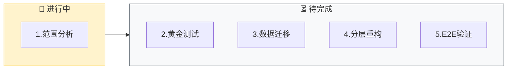
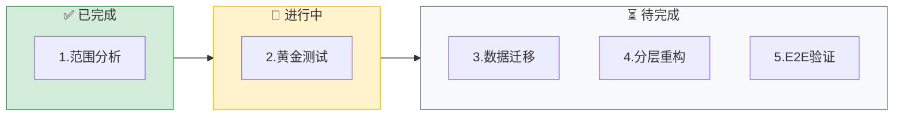

# System Migration (系统迁移)

⚠️ **CRITICAL**: 执行此技能时，MUST 先执行初始化检查，禁止直接开始迁移分析。

**⚠️ 第一步必须执行**: 无论用户消息中是否包含输入，都必须先输出"初始化检查"部分的模板，等待用户提供迁移目标和相关信息后，才能开始执行后续步骤。

此技能协调遗留系统迁移工程，确保重构过程可控、可验证且业务不中断。

> **交互协议**: 本指令严格遵循 `jl-skills/instructions/INTERACTION_PROTOCOL.md` 中定义的交互规范。

---

## ⚠️ 关键行为约束 (CRITICAL BEHAVIOR CONSTRAINTS)

> **这些约束是强制性的，违反将导致流程失败。**

### 约束 0: 初始化检查规则 ⚠️ CRITICAL

```
🛑 STOP RULE: 必须先询问输入

执行任何步骤前，MUST 先检查用户是否提供了必要的输入：
- 有输入 → 确认输入后开始执行
- 无输入 → 必须先询问，禁止直接开始执行

⚠️ 禁止行为：
- ❌ 禁止直接开始分析旧系统
- ❌ 禁止跳过初始化检查
- ❌ 禁止假设用户意图

✅ 必须行为：
- ✅ 必须先输出初始化检查模板
- ✅ 必须等待用户提供迁移目标
- ✅ 必须等待用户提供必要信息
```

### 约束 1: 单步输出规则

```
🛑 ONE STEP AT A TIME

- 每个阶段独立执行
- 每个阶段输出后必须停止，等待用户确认
- 禁止在一次回复中包含多个阶段的内容
- 用户回复"确认/继续/OK"后才能进入下一阶段
```

### 约束 2: 对话框输出 vs 文件写入

```
📤 对话框输出 (每个阶段):
- 进度条和看板表格
- 分析结果和统计
- 确认问题

📁 文件写入 (阶段结束时):
- 每个阶段完成后自动写入对应的报告文件
```

---

## 能力 (Capabilities)

- **范围分析**: 识别旧系统的业务边界和技术债
- **黄金测试**: 建立特征测试集，锁定旧系统行为
- **数据迁移**: 生成 DDL 转换和数据校验脚本
- **架构重构**: 引导 COLA/DDD 分层重构
- **一致性验证**: 自动化比对新旧系统行为

---

## 初始化检查 ⚠️ CRITICAL

> **⚠️ 强制要求**: 无论用户消息中是否包含输入，都必须先执行此初始化检查，禁止直接开始迁移分析。

### 检查 1: 迁移目标

**⚠️ 执行规则（强制）**:
1. **第一步**: 必须先输出下面的"输出模板"，禁止跳过
2. **第二步**: 等待用户提供迁移目标
3. **第三步**: 用户提供输入后，确认输入并开始执行

**禁止行为**:
- ❌ 禁止直接开始分析旧系统
- ❌ 禁止直接开始扫描代码
- ❌ 禁止跳过初始化检查
- ❌ 禁止假设用户意图

**必须行为**:
- ✅ 必须先输出下面的模板
- ✅ 必须等待用户回复
- ✅ 必须等待用户提供必要信息

**输出模板（必须输出）**:

```markdown
## 开始系统迁移

我已准备好协助系统迁移。

**整体流程**:
- 阶段1: 范围分析 - 理解旧系统，划定重构范围
- 阶段2: 黄金测试 - 生成回归测试用例
- 阶段3: 数据迁移 - 数据库迁移脚本
- 阶段4: 分层重构 - 按COLA架构重构代码
- 阶段5: E2E验证 - 端到端验证

---

🛑 **需要您的输入**

请提供以下信息：
1. 旧系统源码路径
2. 迁移范围（全量/特定模块）
3. 目标架构信息（JDK版本、框架、数据库）

**请问旧系统在哪里？**
```

**🛑 STOP - 等待用户提供输入**

⚠️ **重要**:
- 用户未提供输入前，禁止执行任何后续步骤
- 禁止直接开始分析旧系统
- 必须等待用户明确回复

---

## 执行流程（5 阶段）

⚠️ **前置条件检查**:
在执行任何步骤之前，MUST 先完成以下检查：
- ✅ 已输出检查1的模板（迁移目标询问）
- ✅ 用户已提供迁移目标
- ✅ 用户已提供必要信息（迁移范围、目标架构等）

**如果以上条件未满足，禁止执行后续步骤，必须先完成初始化检查。**

---

### 阶段 1: 范围分析 (Scope Analysis)

**加载**: `jl-skills/instructions/migration/scope-analysis-instructions.md`

**⚠️ 执行规则（强制）**:
1. **只加载并执行步骤 1**（确认范围与目标）
2. **输出步骤 1 的内容后，立即停止**
3. **等待用户确认后**，才能继续执行步骤 2（如果有）
4. **禁止一次性输出多个步骤的内容**
5. **禁止跳过用户确认**

**输出**: 确认范围与目标（只输出步骤 1 的内容）

**🛑 STOP HERE - 必须等待用户确认后才能继续**

⚠️ **重要**:
- 用户未回复"确认"前，禁止执行任何后续步骤
- 禁止输出步骤 1 的子步骤（步骤 1.2、1.3）的内容（直到用户确认步骤 1.1）
- 禁止输出阶段2的内容

**输出格式**:

````markdown
## 阶段 1: 范围分析

**目标**: 理解旧系统，划定重构范围

📊 **当前进度**: [1/5] 范围分析
[████░░░░░░░░░░░░░░░░] 20%



---

### 代码结构分析

| 模块 | 文件数 | 代码行数 | 技术债 |
|------|--------|----------|--------|
| OrderService | 15 | 2,500 | 🟠 中 |
| PaymentService | 8 | 1,200 | 🔴 高 |

### 外部依赖
- Redis (缓存)
- RabbitMQ (消息队列)
- 第三方支付 API

### 技术债标记
- ⚠️ SQL 注入风险: PaymentDAO.java:45
- ⚠️ 硬编码配置: OrderService.java:123

---

📋 **确认检查点**

范围分析完成。

- 回复 **确认** → 进入黄金测试阶段
- 回复 **详细 [模块]** → 我将深入分析

**请确认：** 分析是否准确？
````

**[等待用户确认]**

---

### 阶段 2: 黄金测试 (Golden Master)

**前置条件**: 用户已确认阶段1

**加载**: `jl-skills/instructions/migration/golden-test-gen-instructions.md`

**⚠️ 执行规则（强制）**:
1. **只加载并执行步骤 1**（识别关键路径）
2. **输出步骤 1 的内容后，立即停止**
3. **等待用户确认后**，才能继续执行步骤 2（如果有）
4. **禁止一次性输出多个步骤的内容**
5. **禁止跳过用户确认**

**输出**: 识别关键路径（只输出步骤 1 的内容）

**🛑 STOP HERE - 必须等待用户确认后才能继续**

⚠️ **重要**:
- 用户未回复"确认"前，禁止执行任何后续步骤
- 禁止输出步骤 1 的子步骤（步骤 1.2、1.3）的内容（直到用户确认步骤 1.1）
- 禁止输出阶段3的内容

**输出格式**:

````markdown
## 阶段 2: 黄金测试

**目标**: 建立特征测试集，锁定旧系统行为

📊 **当前进度**: [2/5] 黄金测试
[████████░░░░░░░░░░░░] 40%



---

### 核心链路测试用例

```java
@Test
@Tag("golden")
@DisplayName("🟢 正常流程：创建订单应返回成功")
void test_createOrder_validInput_shouldReturnSuccess() {
    // Given
    CreateOrderRequest request = new CreateOrderRequest(1001L, items);
    
    // When
    OrderResponse response = orderController.create(request);
    
    // Then
    assertThat(response.getOrderId()).isNotNull();
    assertThat(response.getStatus()).isEqualTo("CREATED");
}
```

**⚠️ 测试方法命名规范（强制）**:
- **方法名**: 全英文，下划线命名，格式：`test_{methodName}_{condition}_{expectedResult}`
- **中文意图**: 使用 `@DisplayName("中文描述")` 注解
- **TDD 阶段标识（强制）**: 在 TDD 环节，`@DisplayName` 开头必须加上 emoji：
    - 🔴 红灯阶段（Red）: `@DisplayName("🔴 正常流程：...")` - 测试应该失败
    - 🟢 绿灯阶段（Green）: `@DisplayName("🟢 正常流程：...")` - 测试应该通过
- **参考**: `rules/naming-and-comments.md` 中的单元测试命名规范

---

📋 **确认检查点**

已生成 X 个黄金测试用例。

- 回复 **确认** → 进入数据迁移阶段
- 回复 **补充 [场景]** → 我将添加用例

**请确认：** 测试覆盖是否充分？
````

**[等待用户确认]**

---

### 阶段 3-5: 数据迁移、分层重构、E2E 验证

（格式同上，每个阶段展示看板进度和产物，**阶段结束时自动写入报告**）

---

## 阶段性写入规则

| 阶段结束 | 写入文件 |
|----------|----------|
| 阶段1: 范围分析 | `Migration_Scope.md` |
| 阶段2: 黄金测试 | `Golden_Tests.md` |
| 阶段3: 数据迁移 | `DB_Migration.md` |
| 阶段4: 分层重构 | 源代码文件 |
| 阶段5: E2E验证 | `E2E_Report.md` |

---

## 迁移完成: 自动写入最终报告

**触发条件**: 用户确认阶段5后，**立即执行**：

### 1. 写入报告

```
写入文件: jl-skills/generated/migration/{date}/Migration_Report.md
模板: jl-skills/templates/JL-Template-Migration-Context.md
```

### 2. 输出完成总结

````markdown
---

## ✅ 系统迁移完成

| ✅ 已完成 |
|:----------|
| 阶段1: 范围分析 |
| 阶段2: 黄金测试 |
| 阶段3: 数据迁移 |
| 阶段4: 分层重构 |
| 阶段5: E2E验证 |

### 📄 已写入文件

**目录**: `jl-skills/generated/migration/{date}/`

### 质量指标
- 黄金测试覆盖率: **X%**
- 回归测试通过率: **X%**
- 数据一致性: **PASS/FAIL**

### 交付物
- ✓ 迁移上下文报告
- ✓ 黄金测试集
- ✓ 数据库迁移脚本
- ✓ 新架构代码
- ✓ E2E 验证报告

---

### 🗂️ 归档建议

**后续操作**: 运行 `/docs` 指令将本次迁移结果归档为 ADR，并更新文档体系。

**归档内容**:
- ADR 记录: 迁移范围、决策、质量指标
- 文档更新: `docs/ARCHITECTURE.md`（新架构）和 `docs/INTEGRATION.md`（集成变更）

**后续建议**: 运行 `/docs` 更新项目文档
````
