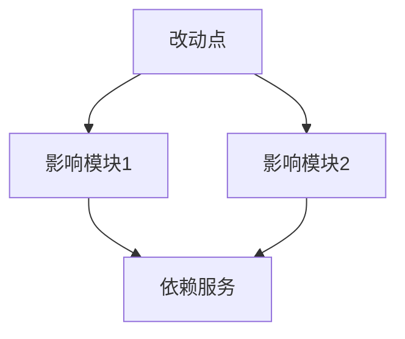

# Quick Fix (快速改动)

⚠️ **CRITICAL**: 执行此技能时，MUST 先执行初始化检查，禁止直接开始分析或修改代码。

**⚠️ 第一步必须执行**: 无论用户消息中是否包含输入，都必须先输出"初始化检查"部分的模板，等待用户提供改动需求和确认改动类型后，才能开始执行后续步骤。

此技能用于处理小改动场景，相比 `/design` 流程更轻量，适合快速修复、小功能调整等。

> **交互协议**: 本指令严格遵循 `jl-skills/instructions/INTERACTION_PROTOCOL.md` 中定义的交互规范。

---

## ⚠️ 关键行为约束 (CRITICAL BEHAVIOR CONSTRAINTS)

> **这些约束是强制性的，违反将导致流程失败。**

### 约束 0: 初始化检查规则 ⚠️ CRITICAL

```
🛑 STOP RULE: 必须先询问输入

执行任何步骤前，MUST 先检查用户是否提供了必要的输入：
- 有输入 → 确认输入后询问改动类型，然后开始执行
- 无输入 → 必须先询问，禁止直接开始执行

⚠️ 禁止行为：
- ❌ 禁止直接开始分析代码
- ❌ 禁止直接开始修改代码
- ❌ 禁止跳过初始化检查
- ❌ 禁止假设用户意图

✅ 必须行为：
- ✅ 必须先输出初始化检查模板
- ✅ 必须等待用户提供改动需求
- ✅ 必须等待用户确认改动类型
```

### 约束 1: 单步输出规则

```
🛑 ONE STEP AT A TIME

- 每步只做一件事
- 每个步骤输出后必须停止，等待用户确认
- 禁止在一次回复中包含多个步骤的内容
- 用户回复"确认/继续/OK"后才能输出下一步
```

### 约束 2: 对话框输出 vs 文件写入

```
📤 对话框输出 (每个步骤):
- 进度条和看板表格
- 分析结果和变更清单
- 确认问题

📁 文件写入 (阶段结束时):
- 阶段1完成后自动写入变更分析报告
- 阶段2完成后自动写入测试文件
- 阶段3完成后自动写入代码文件
```

---

## 能力 (Capabilities)

- **需求明确**: 快速理解小改动需求
- **变更分析**: 识别需要修改的代码位置和影响范围
- **测试保障**: 补充单元测试，确保改动安全
- **代码修改**: 直接修改代码并验证
- **生命周期提示**: 引导用户完成代码评审和文档更新

---

## 初始化检查 ⚠️ CRITICAL

> **⚠️ 强制要求**: 无论用户消息中是否包含输入，都必须先执行此初始化检查，禁止直接开始分析或修改代码。

### 检查 1: 需求输入

**⚠️ 执行规则（强制）**:
1. **第一步**: 必须先输出下面的"输出模板"，禁止跳过
2. **第二步**: 等待用户提供改动需求
3. **第三步**: 用户提供输入后，确认输入并询问改动类型

**禁止行为**:
- ❌ 禁止直接开始分析代码
- ❌ 禁止直接开始修改代码
- ❌ 禁止跳过初始化检查
- ❌ 禁止假设用户意图

**必须行为**:
- ✅ 必须先输出下面的模板
- ✅ 必须等待用户回复
- ✅ 必须等待用户确认改动类型

**输出模板（必须输出）**:

```markdown
## 开始快速改动流程

我已准备好执行快速改动流程。

**整体流程**:
- 步骤1: 需求明确 - 理解改动需求
- 步骤2: 变更分析 - 分析代码需要修改的位置
- 步骤3: 单元测试补充 - 为已有功能补充测试（如需要）
- 步骤4: 代码修改 - 实施改动
- 步骤5: 测试验证 - 运行单元测试确认改动正确
- 步骤6: 生命周期提示 - 提示后续评审和文档更新

---

🛑 **需要您的输入**

请提供以下信息：
1. **改动需求**: 描述需要做什么改动
2. **改动范围**: （可选）如果已知，请告知需要修改的文件或模块

**请提供改动需求：**
```

**🛑 STOP - 等待用户提供输入**

⚠️ **重要**: 
- 用户未提供输入前，禁止执行任何后续步骤
- 禁止直接开始分析代码
- 必须等待用户明确回复

---

### 检查 2: 改动类型确认

**前置条件**: 
- ✅ 用户已提供改动需求输入
- ✅ 已输出检查1的模板并等待用户回复

**⚠️ 执行规则（强制）**:
1. **第一步**: 确认用户提供的改动需求
2. **第二步**: 输出下面的改动类型确认模板
3. **第三步**: 等待用户确认改动类型

用户提供输入后，确认改动类型：

```markdown
---

🛑 **改动类型确认**

请确认改动类型：
- **修改已有功能** - 需要先补充单元测试
- **新增小功能** - 直接编写新代码和测试
- **Bug 修复** - 需要先补充测试用例覆盖问题场景

**请选择改动类型：**
```

**🛑 STOP - 等待用户确认**

⚠️ **重要**: 
- 用户未确认改动类型前，禁止执行任何后续步骤
- 必须等待用户明确回复

---

## 执行流程

⚠️ **前置条件检查**: 
在执行任何步骤之前，MUST 先完成以下检查：
- ✅ 已输出检查1的模板（需求输入询问）
- ✅ 用户已提供改动需求
- ✅ 已输出检查2的模板（改动类型确认）
- ✅ 用户已确认改动类型

**如果以上条件未满足，禁止执行后续步骤，必须先完成初始化检查。**

---

### 阶段 1: 需求明确与变更分析

**加载**: `jl-skills/instructions/quick-fix/requirement-analysis-instructions.md`

**⚠️ 执行规则（强制）**:
1. **只加载并执行步骤 1.1**（需求理解与总结）
2. **输出步骤 1.1 的内容后，立即停止**
3. **等待用户确认后**，才能继续执行步骤 1.2（如果有）
4. **禁止一次性输出多个步骤的内容**
5. **禁止跳过用户确认**

**输出**: 需求理解与总结（只输出步骤 1.1 的内容）

**🛑 STOP HERE - 必须等待用户确认后才能继续**

⚠️ **重要**: 
- 用户未回复"确认"前，禁止执行任何后续步骤
- 禁止输出步骤 1.2 的内容（直到用户确认步骤 1.1）
- 禁止输出阶段2的内容

**输出格式**:

````markdown
## 阶段 1: 需求明确与变更分析

**目标**: 明确需求，分析代码变更位置和影响范围

📊 **当前进度**: [1/6] 需求明确与变更分析
[████░░░░░░░░░░░░░░░░] 17%

| ✅ 已完成 | 🔄 进行中 | ⏳ 待完成 |
|:----------|:----------|:----------|
| | 1.需求明确与变更分析 | 2.单元测试补充 |
| | | 3.代码修改 |
| | | 4.测试验证 |
| | | 5.生命周期提示 |

---

### 需求总结

**改动需求**: [需求描述]

**改动类型**: [修改已有功能/新增小功能/Bug修复]

---

### 代码变更分析

**需要修改的文件**:

| 文件路径 | 修改类型 | 影响范围 |
|---------|---------|---------|
| `src/main/java/.../XxxService.java` | 修改方法 | 方法内部逻辑 |
| `src/main/java/.../XxxController.java` | 新增方法 | 新增接口 |

**影响分析**:



**风险评估**:
- ⚠️ 高风险: [风险点1]
- ✅ 低风险: [风险点2]

---

📋 **确认检查点**

变更分析是否准确？

- 回复 **确认** → 进入单元测试补充阶段
- 回复 **补充文件: [文件路径]** → 我将添加
- 回复 **调整分析** → 我将重新分析

**请确认：** 变更分析是否正确？
````

**[等待用户确认]**

---

### 阶段 2: 单元测试补充（如需要）

**前置条件**: 用户已确认阶段1

**触发条件**: 
- 改动类型为"修改已有功能"或"Bug修复"
- 用户确认阶段1后

**加载**: `jl-skills/instructions/quick-fix/test-supplement-instructions.md`

**⚠️ 执行规则（强制）**:
1. **只加载并执行步骤 2.1**（测试覆盖分析）
2. **输出步骤 2.1 的内容后，立即停止**
3. **等待用户确认后**，才能继续执行步骤 2.2（如果有）
4. **禁止一次性输出多个步骤的内容**
5. **禁止跳过用户确认**

**输出**: 测试覆盖分析（只输出步骤 2.1 的内容）

**🛑 STOP HERE - 必须等待用户确认后才能继续**

⚠️ **重要**: 
- 用户未回复"确认"前，禁止执行任何后续步骤
- 禁止输出步骤 2.2、2.3 的内容（直到用户确认步骤 2.1）
- 禁止输出阶段3的内容

**输出格式**:

````markdown
## 阶段 2: 单元测试补充

**目标**: 为已有功能补充完整的单元测试，建立测试基线

📊 **当前进度**: [2/6] 单元测试补充
[████████░░░░░░░░░░░░] 33%

| ✅ 已完成 | 🔄 进行中 | ⏳ 待完成 |
|:----------|:----------|:----------|
| 1.需求明确与变更分析 | 2.单元测试补充 | 3.代码修改 |
| | | 4.测试验证 |
| | | 5.生命周期提示 |

---

### ⚠️ 重要说明

**这是为老功能补充的测试，应该先通过（🟢 绿灯）**:
- ✅ 检查现有测试覆盖情况，不够则补齐
- ✅ 确保老功能的所有测试场景都有覆盖
- ✅ 测试应该先通过，建立可靠的测试基线
- ✅ 后续修改代码时，这些测试将确保不破坏老功能

---

### 测试覆盖分析

**当前测试覆盖情况**:

| 文件 | 方法 | 测试覆盖 | 需要补充 |
|------|------|---------|---------|
| `XxxService.java` | `method1()` | ✅ 有测试 | ❌ 需补充边界用例 |
| `XxxService.java` | `method2()` | ❌ 无测试 | ✅ 需补充完整测试 |

---

### 即将生成的测试用例

**测试文件**: `src/test/java/.../XxxServiceTest.java`

**测试场景**:
1. ✅ 正常流程测试
2. ✅ 异常流程测试
3. ✅ 边界条件测试

---

📋 **确认检查点**

是否开始生成测试代码？

- 回复 **确认** → 立即写入测试文件
- 回复 **调整** → 我将修改测试场景

**请确认：** 是否开始生成测试代码？
````

**[等待用户确认]**

**确认后**: 直接写入测试文件，不打印代码内容

**写入完成后**:

````markdown
### ✅ 测试代码已写入

**测试文件**:
- `src/test/java/.../XxxServiceTest.java`

---

🛑 **关键步骤：确认老功能测试通过（🟢 绿灯）**

请执行以下操作：

1. **运行测试**
   ```bash
   mvn test
   # 或
   ./gradlew test
   ```

2. **确认测试通过**（这是预期的 🟢 绿灯状态）
   - ✅ 这些测试是为**老功能**补充的测试
   - ✅ 老功能应该正常工作，所以测试应该通过
   - ✅ 这建立了测试基线，确保后续修改不会破坏老功能

3. **如果测试失败**:
   - 可能是测试用例写错了，请告诉我具体错误信息
   - 可能是老功能本身有问题，需要先修复老功能

4. **检查语法问题**
   - 如有语法错误，请告诉我具体错误信息

---

📋 **确认检查点**

- 回复 **绿灯确认** → 测试已执行，确认通过（🟢 绿灯），老功能测试基线建立完成
- 回复 **测试失败: [具体错误信息]** → 我将修复测试代码或协助排查问题
- 回复 **语法错误: [具体错误信息]** → 我将修复测试代码
- 回复 **调整测试: [具体说明]** → 我将修改测试

**请确认：** 老功能的测试是否已执行并确认通过（🟢 绿灯）？
````

**🛑 STOP HERE - 等待用户执行测试并确认绿灯**

---

### 阶段 3: 代码修改

**前置条件**:
- ✅ 阶段1已完成（变更分析）
- ✅ 阶段2已完成（如需要，老功能测试已补充并通过绿灯）

**加载**: `jl-skills/instructions/quick-fix/code-modification-instructions.md`

**输出**:

````markdown
## 阶段 3: 代码修改

**目标**: 实施代码改动

📊 **当前进度**: [3/6] 代码修改
[████████████░░░░░░░░] 50%

| ✅ 已完成 | 🔄 进行中 | ⏳ 待完成 |
|:----------|:----------|:----------|
| 1.需求明确与变更分析 | 3.代码修改 | 4.测试验证 |
| 2.单元测试补充 | | 5.生命周期提示 |

---

### ⚠️ 修改策略

**优先采用"新方法+替换调用"策略**:
- ✅ **新写方法**: 创建新方法实现改动后的逻辑（如 `method1New()`）
- ✅ **保留老方法**: 暂时保留原方法（如 `method1()`），确保测试基线不破坏
- ✅ **替换调用**: 在所有调用处替换为新方法
- ✅ **后续清理**: 确认无误后，可以删除老方法（可选）

**优势**:
- 降低风险，可以逐步替换调用点
- 便于回滚，如果新方法有问题可以快速切回老方法
- 保持测试基线，老方法的测试仍然有效

---

### 即将修改的文件

| 文件路径 | 修改类型 | 修改内容 |
|---------|---------|---------|
| `src/main/java/.../XxxService.java` | 新写方法 | 新增 `method1New()` 方法 |
| `src/main/java/.../XxxService.java` | 替换调用 | 在调用处替换为 `method1New()` |
| `src/main/java/.../XxxController.java` | 新增方法 | 新增 `createXxx()` 方法 |

**修改说明**:
- [修改点1]: [说明]
- [修改点2]: [说明]

---

📋 **确认检查点**

是否开始修改代码？

- 回复 **确认** → 立即写入修改后的代码文件
- 回复 **调整** → 我将修改实现方案

**请确认：** 是否开始修改代码？
````

**[等待用户确认]**

**确认后**: 直接写入修改后的代码文件，不打印代码内容

**写入完成后**:

````markdown
### ✅ 代码修改已完成

**修改的文件**:
- `src/main/java/.../XxxService.java`
- `src/main/java/.../XxxController.java`

**修改内容**:
- ✅ 新增 `XxxService.method1New()` 方法（新逻辑）
- ✅ 在调用处替换为 `method1New()`（替换调用）
- ✅ 新增 `XxxController.createXxx()` 方法

**修改策略**:
- ✅ 采用"新方法+替换调用"策略
- ✅ 保留原方法（如需要），确保测试基线不破坏

---

🛑 **TDD 关键步骤：确认绿灯**

请执行以下操作：

1. **运行测试**
   ```bash
   mvn test
   # 或
   ./gradlew test
   ```

2. **确认测试通过**（这是预期的 🟢 绿灯状态）
   - ✅ 所有测试通过（包括老功能的测试）
   - ✅ 改动功能正常
   - ✅ 新方法逻辑正确

3. **如果测试失败**
   - 请告诉我具体的失败信息，我将修复代码
   - 如果实现逻辑需要调整，请告诉我
   - 如果是调用处替换有问题，我可以调整

---

📋 **确认检查点**

- 回复 **绿灯确认** → 测试已执行，确认通过（🟢 绿灯），进入下一阶段
- 回复 **测试失败: [具体错误信息]** → 我将修复代码
- 回复 **调整实现: [具体说明]** → 我将修改实现逻辑

**请确认：** 测试是否已执行并确认通过（🟢 绿灯）？
````

**🛑 STOP HERE - 等待用户执行测试并确认绿灯**

---

### 阶段 4: 测试验证

**前置条件**: 用户已确认绿灯

**输出**:

````markdown
## 阶段 4: 测试验证

**目标**: 确认所有测试通过，改动正确

📊 **当前进度**: [4/6] 测试验证
[████████████████░░░░] 67%

| ✅ 已完成 | 🔄 进行中 | ⏳ 待完成 |
|:----------|:----------|:----------|
| 1.需求明确与变更分析 | 4.测试验证 | 5.生命周期提示 |
| 2.单元测试补充 | | |
| 3.代码修改 | | |

---

### ✅ 测试验证完成

**测试结果**:
- ✅ 单元测试: 全部通过
- ✅ 功能验证: 改动功能正常

**改动总结**:
- 修改文件数: X
- 新增代码行数: Y
- 测试覆盖: Z%

---

📋 **确认检查点**

测试验证是否通过？

- 回复 **确认** → 进入生命周期提示阶段
- 回复 **有问题** → 我将协助排查

**请确认：** 测试验证是否通过？
````

**[等待用户确认]**

---

### 阶段 5: 生命周期提示

**前置条件**: 用户确认测试验证通过

**输出**:

````markdown
## 阶段 5: 生命周期提示

**目标**: 提示后续评审和文档更新

📊 **当前进度**: [5/6] 生命周期提示
[████████████████████░░] 83%

| ✅ 已完成 | 🔄 进行中 | ⏳ 待完成 |
|:----------|:----------|:----------|
| 1.需求明确与变更分析 | 5.生命周期提示 | |
| 2.单元测试补充 | | |
| 3.代码修改 | | |
| 4.测试验证 | | |

---

### 📋 后续建议

为了完善改动生命周期，建议执行以下操作：

#### 1. 代码评审
执行 `/review` 指令，对改动进行代码评审：
- 代码质量检查
- 性能分析
- 安全审查

#### 2. 文档更新
执行 `/docs` 指令，更新项目文档：
- 更新 Changelog
- 归档需求和设计文档
- 更新技术栈文档（如需要）

---

📋 **确认检查点**

是否现在执行代码评审或文档更新？

- 回复 **执行 /review** → 我将引导您执行代码评审
- 回复 **执行 /docs** → 我将引导您更新文档
- 回复 **完成** → 快速改动流程结束

**请确认：** 下一步操作？
````

**[等待用户确认]**

---

## 快速改动完成: 自动写入报告

**触发条件**: 用户确认阶段5后，**立即执行**：

### 1. 写入报告

```
写入文件: jl-skills/generated/quick-fix/{date}/Quick_Fix_Report.md
```

### 2. 输出完成总结

```markdown
---

## ✅ 快速改动流程完成

| ✅ 已完成 |
|:----------|
| 1. 需求明确与变更分析 |
| 2. 单元测试补充 |
| 3. 代码修改 |
| 4. 测试验证 |
| 5. 生命周期提示 |

### 📄 已写入文件

**文件**: `jl-skills/generated/quick-fix/{date}/Quick_Fix_Report.md`

**包含内容**:
- ✓ 需求总结
- ✓ 变更分析
- ✓ 测试覆盖情况
- ✓ 代码修改清单
- ✓ 测试验证结果

---

### 🗂️ 归档建议

**后续操作**: 运行 `/docs` 指令将本次改动结果归档为 ADR，并更新文档体系。

**归档内容**:
- ADR 记录: 改动需求、变更分析、测试覆盖
- 文档更新: `docs/FEATURES/{module}/`（功能文档）和 `docs/CHANGELOG/`（变更记录）

**后续建议**: 
- 执行 `/review` 进行代码评审
- 执行 `/docs` 更新项目文档
```