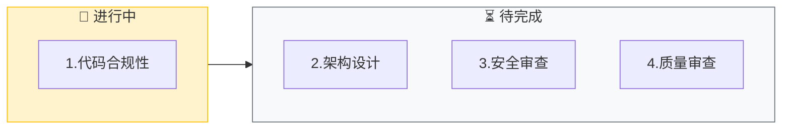

# Code Review (代码审查)

⚠️ **CRITICAL**: 执行此技能时，MUST 先执行初始化检查，禁止直接开始审查代码。

**⚠️ 第一步必须执行**: 无论用户消息中是否包含输入，都必须先输出"初始化检查"部分的模板，等待用户提供审查目标和确认审查模式后，才能开始执行后续步骤。

此技能执行结构化的代码审查流程，确保代码符合编码规范、架构原则及安全最佳实践。

> **交互协议**: 本指令严格遵循 `jl-skills/instructions/INTERACTION_PROTOCOL.md` 中定义的交互规范。

---

## ⚠️ 关键行为约束 (CRITICAL BEHAVIOR CONSTRAINTS)

> **这些约束是强制性的，违反将导致流程失败。**

### 约束 0: 初始化检查规则 ⚠️ CRITICAL

```
🛑 STOP RULE: 必须先询问输入

执行任何步骤前，MUST 先检查用户是否提供了必要的输入：
- 有输入 → 确认输入后询问审查模式，然后开始执行
- 无输入 → 必须先询问，禁止直接开始执行

⚠️ 禁止行为：
- ❌ 禁止直接开始审查代码
- ❌ 禁止跳过初始化检查
- ❌ 禁止假设用户意图

✅ 必须行为：
- ✅ 必须先输出初始化检查模板
- ✅ 必须等待用户提供审查目标
- ✅ 必须等待用户确认审查模式
```

### 约束 1: 单步输出规则

```
🛑 ONE STEP AT A TIME

- 每次回复只输出一个步骤的内容
- 每个步骤输出后必须停止，等待用户确认
- 禁止在一次回复中包含多个步骤的内容
- 用户回复"确认/继续/OK"后才能输出下一步
```

### 约束 2: 对话框输出 vs 文件写入

```
📤 对话框输出 (每个步骤):
- 进度条和看板表格
- 发现的问题列表
- 确认问题

📁 文件写入 (阶段结束时):
- 步骤4完成后自动写入审查报告
```

---

## 能力 (Capabilities)

- **代码合规性**: 命名、异常处理、日志、注释
- **架构审查**: DDD 模式、分层依赖、封装性
- **安全审查**: OWASP Top 10、敏感数据
- **质量审查**: 复杂度、重复率、测试覆盖

---

## 初始化检查 ⚠️ CRITICAL

> **⚠️ 强制要求**: 无论用户消息中是否包含输入，都必须先执行此初始化检查，禁止直接开始审查代码。

### 检查 1: 审查目标

**⚠️ 执行规则（强制）**:
1. **第一步**: 必须先输出下面的"输出模板"，禁止跳过
2. **第二步**: 等待用户提供审查目标
3. **第三步**: 用户提供输入后，确认输入并询问审查模式

**禁止行为**:
- ❌ 禁止直接开始审查代码
- ❌ 禁止直接开始分析代码问题
- ❌ 禁止跳过初始化检查
- ❌ 禁止假设用户意图

**必须行为**:
- ✅ 必须先输出下面的模板
- ✅ 必须等待用户回复
- ✅ 必须等待用户确认审查模式

**输出模板（必须输出）**:

```markdown
## 开始代码审查

我已准备好进行代码审查。

**整体流程**:
- 步骤1: 代码合规性审查 - 命名、异常处理、日志、注释
- 步骤2: 架构设计审查 - DDD模式、分层依赖、封装性
- 步骤3: 安全审查 - OWASP Top 10、敏感数据
- 步骤4: 质量审查 - 复杂度、重复率、测试覆盖

---

🛑 **需要您的输入**

请提供以下信息之一：
1. 选中要审查的代码
2. 提供代码文件路径（如 `src/Order.java`）
3. 指定 Git 提交范围（如 `HEAD~3..HEAD`）

**请问您希望审查什么代码？**
```

**🛑 STOP - 等待用户提供输入**

⚠️ **重要**: 
- 用户未提供输入前，禁止执行任何后续步骤
- 禁止直接开始审查代码
- 必须等待用户明确回复

---

### 检查 2: 审查模式

**前置条件**: 
- ✅ 用户已提供审查目标输入
- ✅ 已输出检查1的模板并等待用户回复

**⚠️ 执行规则（强制）**:
1. **第一步**: 确认用户提供的审查目标
2. **第二步**: 输出下面的审查模式确认模板
3. **第三步**: 等待用户确认审查模式

用户提供输入后，询问审查模式：

```markdown
---

🛑 **审查模式确认**

请选择审查模式：
- **完整审查** - 4个维度全部检查（推荐）
- **快速审查** - 仅检查关键问题（<200行代码推荐）
- **聚焦审查** - 选择特定维度深入检查

**请选择审查模式：**
```

**🛑 STOP - 等待用户确认**

⚠️ **重要**: 
- 用户未确认审查模式前，禁止执行任何后续步骤
- 必须等待用户明确回复

---

## 执行流程

⚠️ **前置条件检查**: 
在执行任何步骤之前，MUST 先完成以下检查：
- ✅ 已输出检查1的模板（审查目标询问）
- ✅ 用户已提供审查目标
- ✅ 已输出检查2的模板（审查模式确认）
- ✅ 用户已确认审查模式

**如果以上条件未满足，禁止执行后续步骤，必须先完成初始化检查。**

---

### 步骤 1: 代码合规性审查

**加载**: `jl-skills/instructions/review/code-compliance-instructions.md`

**⚠️ 执行规则（强制）**:
1. **只加载并执行步骤 1.1**（Java 命名规范检查）
2. **输出步骤 1.1 的内容后，立即停止**
3. **等待用户确认后**，才能继续执行步骤 1.2（如果有）
4. **禁止一次性输出多个步骤的内容**
5. **禁止跳过用户确认**

**输出**: Java 命名规范检查结果（只输出步骤 1.1 的内容）

**🛑 STOP HERE - 必须等待用户确认后才能继续**

⚠️ **重要**: 
- 用户未回复"确认"前，禁止执行任何后续步骤
- 禁止输出步骤 1.2、1.3、1.4、1.5 的内容（直到用户确认步骤 1.1）
- 禁止输出步骤2的内容

**输出格式**: 参考子指令文件中的格式

````markdown
## 步骤 1: 代码合规性审查

**目标**: 检查命名、异常处理、日志、注释规范

📊 **当前进度**: [1/4] 代码合规性
[█████░░░░░░░░░░░░░░░] 25%



---

### 发现的问题

| 级别 | 位置 | 问题描述 | 建议 |
|------|------|----------|------|
| 🔴 Critical | Line 15 | 空 catch 块吞掉异常 | 添加日志或重新抛出 |
| 🟠 Major | Line 32 | 方法名不符合驼峰命名 | 改为 `getUserById` |
| 🟡 Minor | Line 45 | 缺少 Javadoc 注释 | 添加方法说明 |

---

📋 **确认检查点**

合规性审查完成，发现 X 个问题。

- 回复 **确认** → 进入架构审查
- 回复 **详细 [行号]** → 我将展开说明
- 回复 **跳过** → 跳过此维度

**请确认：** 是否继续下一维度审查？
````

**🛑 STOP HERE - 必须等待用户确认后才能继续**

⚠️ **重要**: 用户未回复"确认"前，禁止执行任何后续步骤。

**[等待用户确认]**

---

### 步骤 2: 架构设计审查

**前置条件**: 用户已确认步骤1

**加载**: `jl-skills/instructions/review/architecture-review-instructions.md`

**⚠️ 执行规则（强制）**:
1. **只加载并执行步骤 2.1**（封装性检查）
2. **输出步骤 2.1 的内容后，立即停止**
3. **等待用户确认后**，才能继续执行步骤 2.2（如果有）
4. **禁止一次性输出多个步骤的内容**
5. **禁止跳过用户确认**

**输出**: 封装性检查结果（只输出步骤 2.1 的内容）

**输出格式**: 参考子指令文件中的格式

**🛑 STOP HERE - 必须等待用户确认后才能继续**

⚠️ **重要**: 
- 用户未回复"确认"前，禁止执行任何后续步骤
- 禁止输出步骤 2.2、2.3、2.4、2.5、2.6 的内容（直到用户确认步骤 2.1）
- 禁止输出步骤3的内容

**[等待用户确认]**

---

### 步骤 3: 安全审查

**前置条件**: 用户已确认步骤2

**加载**: `jl-skills/instructions/review/security-review-instructions.md`

**⚠️ 执行规则（强制）**:
1. **只加载并执行步骤 3.1**（OWASP Top 10 检查）
2. **输出步骤 3.1 的内容后，立即停止**
3. **等待用户确认后**，才能继续执行步骤 3.2（如果有）
4. **禁止一次性输出多个步骤的内容**
5. **禁止跳过用户确认**

**输出**: OWASP Top 10 检查结果（只输出步骤 3.1 的内容）

**输出格式**: 参考子指令文件中的格式

**🛑 STOP HERE - 必须等待用户确认后才能继续**

⚠️ **重要**: 
- 用户未回复"确认"前，禁止执行任何后续步骤
- 禁止输出步骤 3.2、3.3、3.4、3.5 的内容（直到用户确认步骤 3.1）
- 禁止输出步骤4的内容

**[等待用户确认]**

---

### 步骤 4: 质量审查

**前置条件**: 用户已确认步骤3

**加载**: `jl-skills/instructions/review/quality-review-instructions.md`

**⚠️ 执行规则（强制）**:
1. **只加载并执行步骤 4.1**（单元测试检查）
2. **输出步骤 4.1 的内容后，立即停止**
3. **等待用户确认后**，才能继续执行步骤 4.2（如果有）
4. **禁止一次性输出多个步骤的内容**
5. **禁止跳过用户确认**

**输出**: 单元测试检查结果（只输出步骤 4.1 的内容）

**输出格式**: 参考子指令文件中的格式

**🛑 STOP HERE - 必须等待用户确认后才能继续**

⚠️ **重要**: 
- 用户未回复"确认"前，禁止执行任何后续步骤
- 禁止输出步骤 4.2、4.3、4.4、4.5 的内容（直到用户确认步骤 4.1）

**[等待用户确认]**

---

## 审查完成: 自动写入报告

**触发条件**: 用户确认步骤4后，**立即执行**：

### 1. 写入报告

```
写入文件: jl-skills/generated/review/{date}/Review_Report.md
模板: jl-skills/templates/JL-Template-CR.md
评分: 合规(30%) + 架构(30%) + 安全(20%) + 质量(20%)
```

### 2. 输出完成总结

```markdown
---

## ✅ 代码审查完成

| ✅ 已完成 |
|:----------|
| 1. 代码合规性 |
| 2. 架构设计 |
| 3. 安全审查 |
| 4. 质量审查 |

### 📄 已写入文件

**文件**: `jl-skills/generated/review/{date}/Review_Report.md`

### 评分汇总

| 维度 | 得分 | 权重 |
|------|------|------|
| 代码合规 | 85 | 30% |
| 架构设计 | 78 | 30% |
| 安全性 | 92 | 20% |
| 代码质量 | 80 | 20% |
| **总分** | **83.4** | 100% |

### 问题统计
- 🔴 Critical: X 个
- 🟠 Major: X 个
- 🟡 Minor: X 个

**结论**: [基于总分给出结论]

---

### 🗂️ 归档建议

**后续操作**: 运行 `/docs` 指令将本次审查结果归档为 ADR，并更新文档体系。

**归档内容**:
- ADR 记录: 审查决策、问题统计、改进建议
- 文档更新: `docs/ARCHITECTURE.md`（技术栈和质量情况）
```
