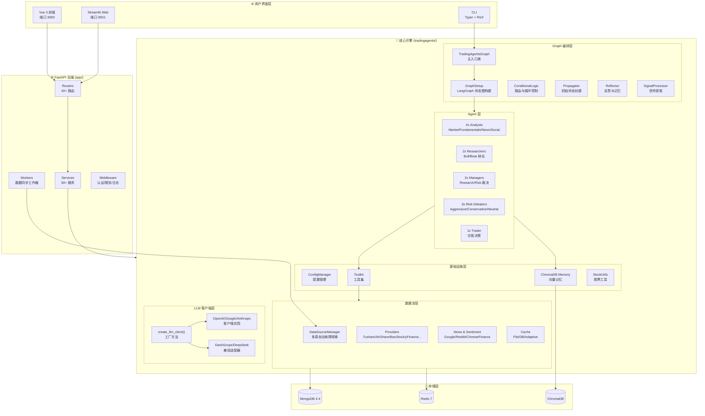
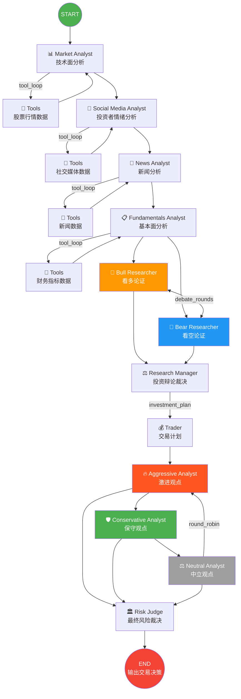
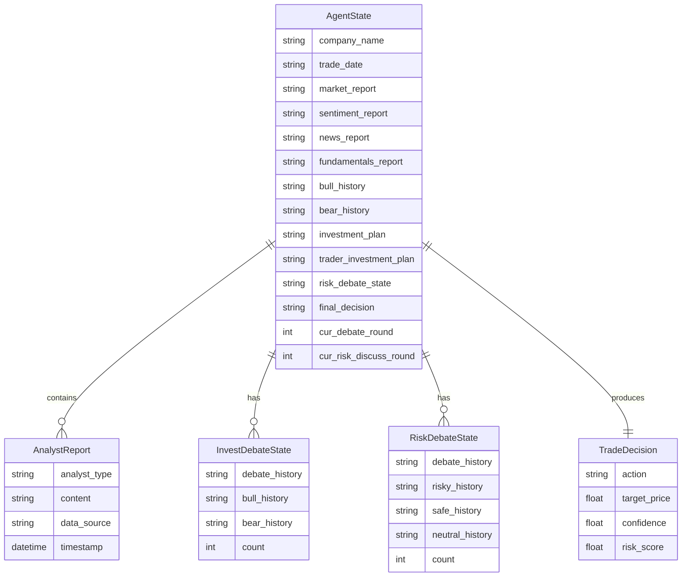
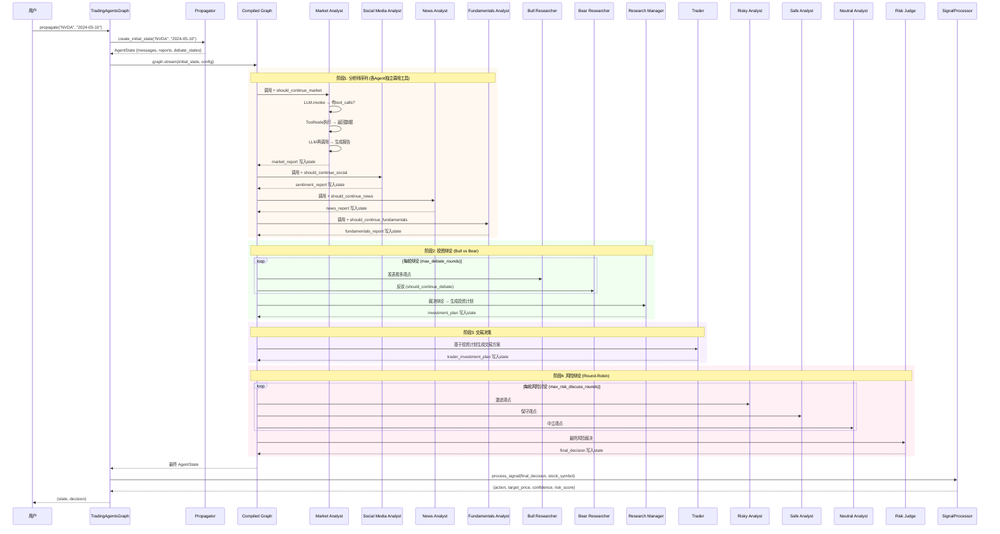
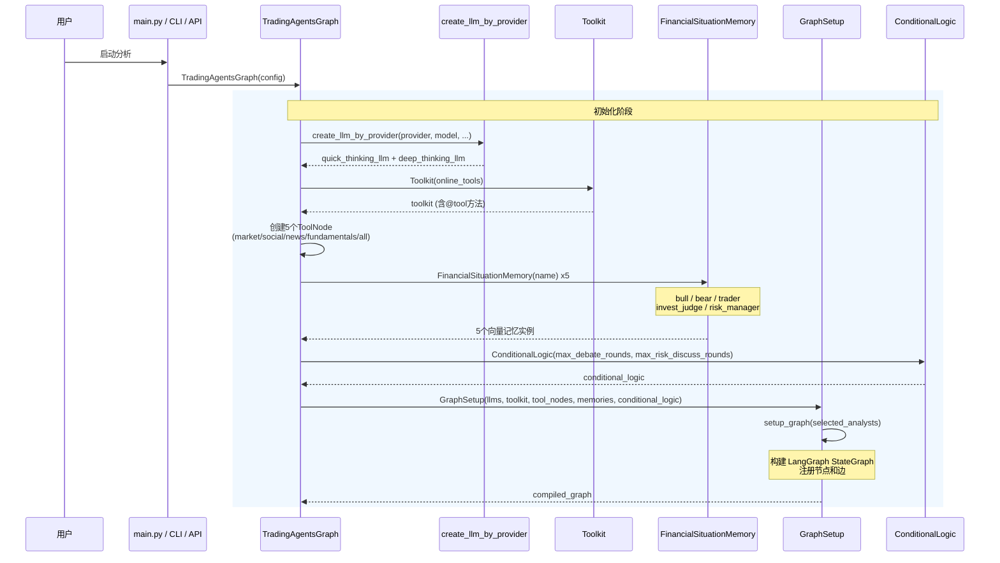
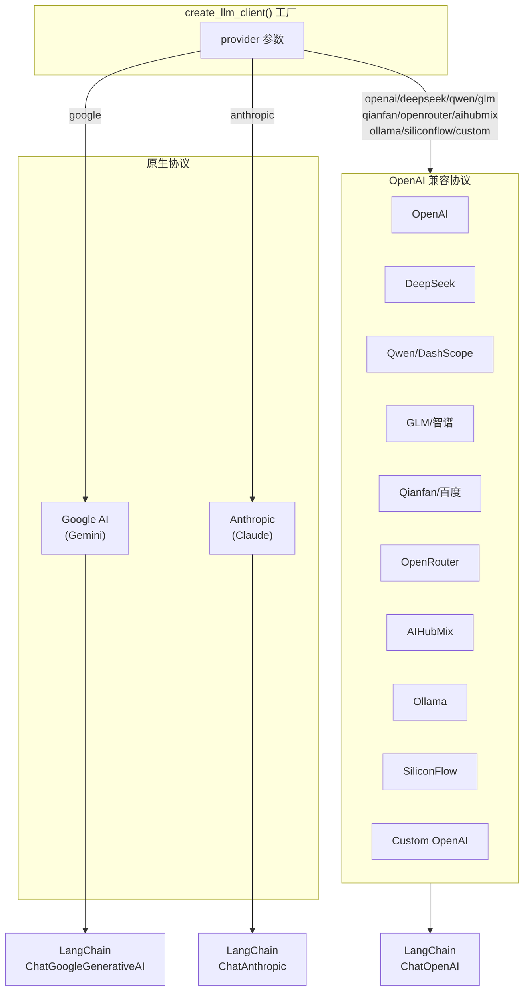
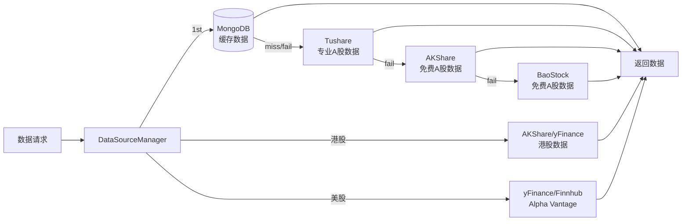
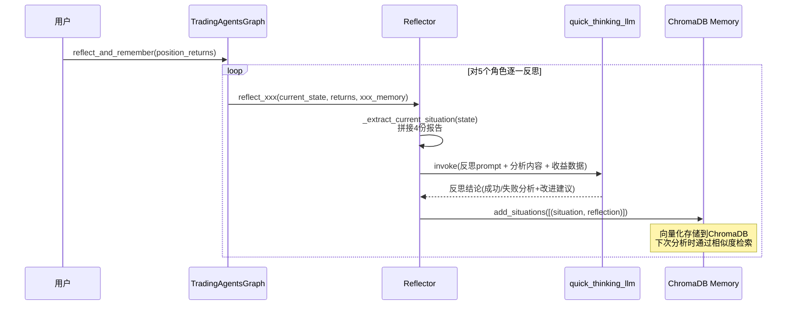

# TradingAgents-CN 代码深度分析报告

> 生成日期: 2026-04-22
> 分析目标: 整体运行机制分析
> 分析角色: 开发人员

---

## 1. 项目概述

TradingAgents-CN 是一个**基于 LangGraph 的多Agent股票分析系统**，专为A股/港股/美股设计。系统通过多个专业化AI Agent的协作与辩论，生成结构化的投资决策建议。

### 核心特点
- 12+ LLM 提供商支持（OpenAI/DeepSeek/Qwen/Google/Anthropic/GLM等）
- 6+ 金融数据源自动故障转移（MongoDB→Tushare→AKShare→BaoStock）
- 4种分析师 + 看多/看空辩论 + 风险辩论的多层决策机制
- 向量记忆（ChromaDB）支持Agent从历史决策中学习
- 三种用户界面：CLI / Streamlit / Vue+FastAPI 全栈

---

## 2. 技术栈

| 层级 | 技术 | 说明 |
|------|------|------|
| **语言** | Python 3.10+ | 核心业务逻辑 |
| **AI框架** | LangGraph + LangChain | 多Agent编排与LLM调用 |
| **LLM** | OpenAI / DeepSeek / Qwen / Google / Anthropic / GLM 等 12+ | 支持多模型切换 |
| **后端** | FastAPI + Uvicorn | REST API 服务 (端口 8000) |
| **前端(SPA)** | Vue 3 + TypeScript + Vite + Element Plus | 完整管理界面 (端口 3000) |
| **前端(轻量)** | Streamlit | 快速部署 Web UI (端口 8501) |
| **CLI** | Typer + Rich | 终端交互界面 |
| **数据库** | MongoDB 4.4 | 主数据存储 |
| **缓存** | Redis 7 | 缓存 + 会话管理 |
| **向量存储** | ChromaDB | Agent 记忆向量库 |
| **金融数据** | AKShare / Tushare / BaoStock / yFinance / Finnhub / Alpha Vantage | 多源数据获取 |
| **部署** | Docker Compose + Nginx | 容器化前后端分离部署 |

---

## 3. 模块结构图



---

## 4. Agent 工作流图



---

## 5. 核心实体关系 (ER)



---

## 6. 核心分析执行时序图



---

## 7. 启动与初始化时序



---

## 8. 条件路由逻辑

```mermaid
flowchart TD
    subgraph analyst_loop["分析师工具循环"]
        A1["Analyst 调用LLM"] --> A2{"last_message<br/>有tool_calls?"}
        A2 -->|是| A3{"tool_call_count<br/>>= max?"}
        A3 -->|否| A4["→ tools_xxx<br/>执行工具调用"]
        A4 --> A1
        A3 -->|是| A5["→ Msg Clear xxx<br/>强制结束(防死循环)"]
        A2 -->|否| A6{"report已存在<br/>且>100字符?"}
        A6 -->|是| A5
        A6 -->|否| A5
    end

    subgraph debate_loop["投资辩论循环"]
        B1["Bull Researcher"] --> B2{"count >=<br/>2×max_rounds?"}
        B2 -->|否| B3["→ Bear Researcher"]
        B3 --> B4{"count >=<br/>2×max_rounds?"}
        B4 -->|否| B1
        B4 -->|是| B5["→ Research Manager"]
        B2 -->|是| B5
    end

    subgraph risk_loop["风险讨论循环"]
        R1["Risky Analyst"] --> R2{"count >=<br/>3×max_rounds?"}
        R2 -->|否| R3["→ Safe Analyst"]
        R3 --> R4{"count >=<br/>3×max_rounds?"}
        R4 -->|否| R5["→ Neutral Analyst"]
        R5 --> R6{"count >=<br/>3×max_rounds?"}
        R6 -->|否| R1
        R6 -->|是| R7["→ Risk Judge"]
        R4 -->|是| R7
        R2 -->|是| R7
    end

    style A5 fill:#4caf50,color:#fff
    style B5 fill:#4caf50,color:#fff
    style R7 fill:#f44336,color:#fff
```



---

## 9. LLM 客户端架构



---

## 10. 数据源故障转移



---

## 11. 状态流转图

```mermaid
stateDiagram-v2
    [*] --> Init: propagate(company, date)

    Init --> MarketAnalysis: messages=[分析请求]
    MarketAnalysis --> SocialAnalysis: market_report ✅
    SocialAnalysis --> NewsAnalysis: sentiment_report ✅
    NewsAnalysis --> FundamentalsAnalysis: news_report ✅
    FundamentalsAnalysis --> BullDebate: fundamentals_report ✅

    state BullDebate {
        [*] -> BullSpeaking
        BullSpeaking -> BearSpeaking: bull_history更新
        BearSpeaking -> BullSpeaking: bear_history更新
        BullSpeaking -> DebateDone: count >= 2×max_rounds
        BearSpeaking -> DebateDone: count >= 2×max_rounds
    }

    BullDebate --> ResearchJudge: investment_debate_state ✅
    ResearchJudge --> TraderDecision: investment_plan ✅
    TraderDecision --> RiskDebate: trader_investment_plan ✅

    state RiskDebate {
        [*] -> RiskySpeaking
        RiskySpeaking -> SafeSpeaking: risky_history更新
        SafeSpeaking -> NeutralSpeaking: safe_history更新
        NeutralSpeaking -> RiskySpeaking: neutral_history更新
        NeutralSpeaking -> RiskDone: count >= 3×max_rounds
    }

    RiskDebate --> FinalDecision: risk_debate_state ✅
    FinalDecision --> SignalExtracted: final_decision ✅

    SignalExtracted --> [*]: {action, target_price, confidence, risk_score}
```

---

## 12. 反思与记忆流程



---

## 13. 调用链总表

| 入口 | 调用路径 | LLM | 工具调用 | 出口 |
|------|----------|-----|----------|------|
| `propagate(company, date)` | Propagator → Graph.stream → ... → SignalProcessor | quick + deep | 最多3次/分析师 | TradeDecision |
| Market Analyst | LLM.bind_tools(tools) → ToolNode → LLM再调用 | quick | `get_stock_market_data_unified` | market_report |
| Social Media Analyst | LLM.bind_tools(tools) → ToolNode → LLM再调用 | quick | `get_stock_sentiment_unified` | sentiment_report |
| News Analyst | LLM.bind_tools(tools) → ToolNode → LLM再调用 | quick | `get_stock_news_unified` | news_report |
| Fundamentals Analyst | LLM.bind_tools(tools) → ToolNode → LLM再调用 | quick | `get_stock_fundamentals_unified` | fundamentals_report |
| Bull/Bear Debate | LLM.invoke(memory_context) 轮流发言 | quick | 无 | debate_history |
| Research Manager | LLM.invoke(debate_context) | **deep** | 无 | investment_plan |
| Trader | LLM.invoke(investment_plan) | quick | 无 | trader_investment_plan |
| Risk Debate | LLM.invoke(risk_context) 轮流发言 | quick | 无 | risk_debate_history |
| Risk Judge | LLM.invoke(risk_context) | **deep** | 无 | final_decision |
| SignalProcessor | LLM.invoke(extract_prompt) | quick | 无 | {action, price, confidence, risk} |

---

## 14. 关键实现细节

### 14.1 LLM 双模型策略
- `quick_thinking_llm`: 用于分析师、辩论者、交易员（需要快速响应）
- `deep_thinking_llm`: 仅用于 Research Manager 和 Risk Judge（需要深度推理）

### 14.2 工具调用防死循环机制
每个 `should_continue_xxx` 方法都有三层保护：
1. `tool_call_count >= max_tool_calls` → 强制结束
2. `report长度 > 100字符` → 报告已完成，结束
3. `last_message无tool_calls` → 正常结束

### 14.3 消息清理机制 (Msg Clear 节点)
- 每个分析师完成后，清除 `messages` 列表中的历史消息
- 防止上下文窗口溢出，确保下一阶段只看到相关输入

### 14.4 向量记忆检索 (FinancialSituationMemory)
- 每次Agent调用时，从ChromaDB检索与当前情境相似的历史反思
- 作为system prompt的一部分注入，帮助Agent从过去的决策中学习

### 14.5 信号提取容错 (SignalProcessor)
- LLM返回JSON → 解析提取结构化决策
- JSON解析失败 → 正则表达式从文本中提取
- 正则提取失败 → `_smart_price_estimation` 智能推算目标价
- 全部失败 → 返回默认"持有"决策

---

## 15. 运行方式

| 方式 | 入口 | 端口 | 适用场景 |
|------|------|------|----------|
| **Python直接运行** | `python main.py` | - | 最简方式，单次分析 |
| **CLI** | `python -m cli` | - | 终端交互，选择Provider/分析师/深度 |
| **Streamlit** | `python web/run_web.py` | 8501 | 快速部署，轻量Web界面 |
| **Full Stack** | `docker-compose up` | 3000/8000 | 生产部署，Vue前端+FastAPI后端 |
